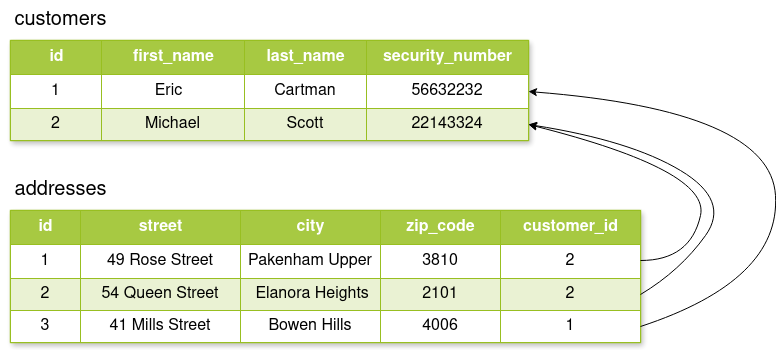
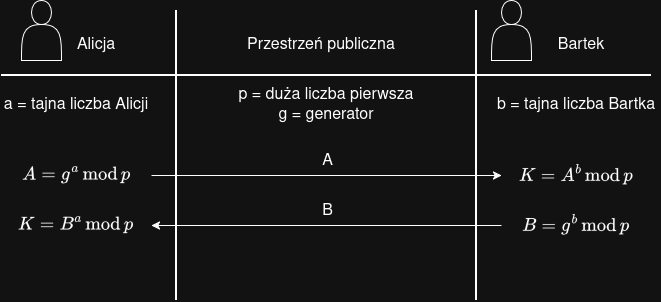
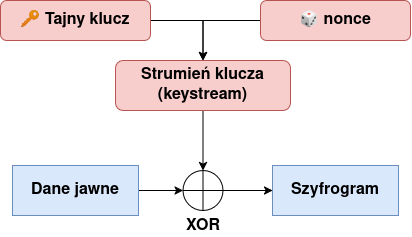
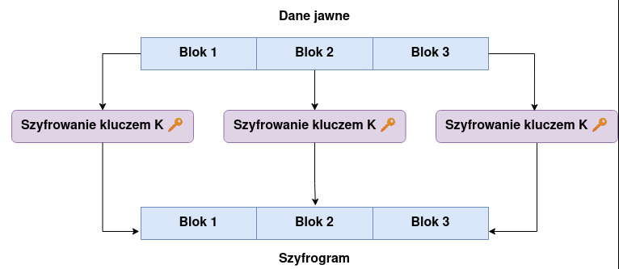
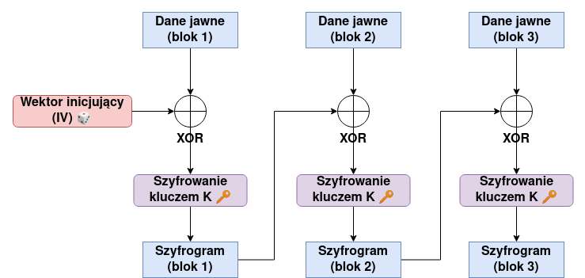
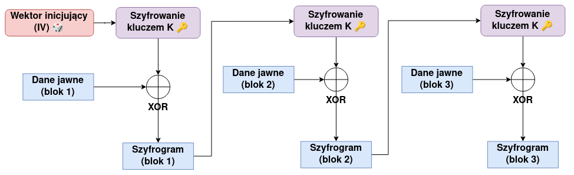
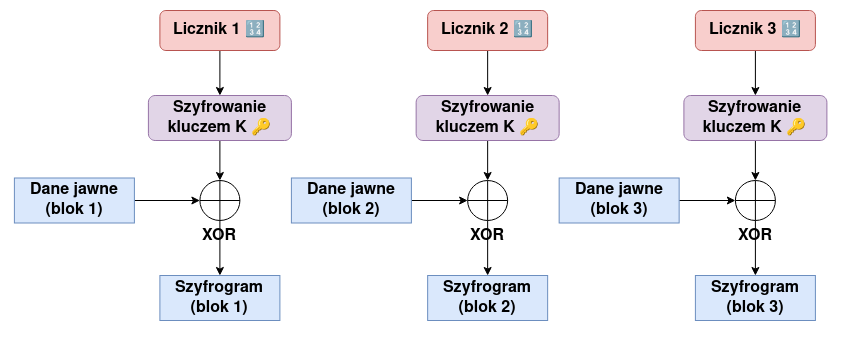

# 1.4 Explain the importance of using appropriate cryptographic solutions
Wyjaśnij istotę i wagę stosowania odpowiednich rozwiązań kryptograficznych.
# Public key infrastructure (PKI)
Uwaga! Pojęcie infrastruktury klucza publicznego jest ściśle powiązane z certyfikatami cyfrowymi, jednakże w poniższym opracowaniu skupimy się na ogólnym wyjaśnieniu potrzeby istnienia takiej infrastruktury oraz na samych kluczach kryptograficznych. Same certyfikaty zostaną natomiast omówione w jednym z kolejnych opracowań.
## PKI - definicja
**Infrastruktura klucza publicznego** (PKI, *Public Key Infrastructure*) to termin o szerokim znaczeniu, jednak najczęściej stosuje się go w odniesieniu do **kompletnego systemu opartego na kryptografii klucza publicznego, którego celem jest weryfikacja tożsamości oraz wiarygodności użytkowników, systemów lub urządzeń poprzez cyfrowe certyfikaty** (ang. *digital certificates*) wykorzystywane w komunikacji elektronicznej.

Pojęcie _framework_ w tym kontekście obejmuje wszystkie **środki oraz procesy umożliwiające zarządzanie certyfikatami elektronicznymi i komponentami związanymi z szyfrowaniem przy użyciu klucza publicznego** (_public key encryption_). Do wspomnianych **środków** zalicza się takie elementy jak **sprzęt, oprogramowanie oraz sformalizowane polityki (ang. _policies_) i procedury**. Natomiast **zarządzanie certyfikatami** polega na ich **tworzeniu, dystrybucji, przechowywaniu oraz unieważnianiu (ang. _revocation_)**, gdy zachodzi taka potrzeba.

Głównym zadaniem infrastruktury klucza publicznego jest **zapewnienie poufności oraz wiarygodności komunikacji**. W tym celu PKI łączy takie mechanizmy jak kryptografia symetryczna i asymetryczna, [funkcje skrótu (_hashing_)](https://vilya.pl/sy0-701-hashing-pl/) oraz [podpisy cyfrowe](https://vilya.pl/comptia-security-sy0-701-digital-signatures-pl/), a następnie opakowuje je w tzw. **cyfrowe certyfikaty**, o których powiemy sobie więcej w jednym z przyszłych opracowań.
## PKI - poufność
Aby zrozumieć istotę PKI, trzeba najpierw przypomnieć sobie kilka podstawowych pojęć z zakresu kryptografii. Zacznijmy od szyfrowania, które zapewnia poufność komunikacji. Do szyfrowania (oraz odszyfrowywania) wiadomości używa się specjalnych **algorytmów kryptograficznych**, które opierają się na koncepcji **kluczy** (ang. *keys*). **Klucz to pewna wartość, zwykle w postaci ciągu losowych znaków, która służy do _pomieszania_ (szyfrowania) danych w taki sposób, aby nie dało się ich odczytać bez znajomości tego klucza**.

Algorytmy szyfrowania dzielimy głównie na algorytmy **symetryczne** (ang. _symmetric encryption_) oraz **asymetryczne** (ang. _asymmetric encryption_):
- **Kryptografia symetryczna** - ten sam tajny (ang. _secret_) i współdzielony (ang. _shared_) klucz jest wykorzystywany zarówno do zaszyfrowania wiadomości, jak i do jej odszyfrowania. Zaletą tych algorytmów jest duża szybkość działania, a ich główną wadą - trudność bezpiecznego przekazania klucza między uczestnikami komunikacji w taki sposób, aby nie trafił on w niepowołane ręce.
- **Kryptografia asymetryczna** - nazywana również **kryptografią klucza publicznego** (ang. _public key cryptography_) - wykorzystuje parę matematycznie powiązanych kluczy: **publiczny** (ang. *public key*) oraz **prywatny** (ang. *private key*). Jej zasada działania opiera się na tym, że wiadomość zaszyfrowana kluczem publicznym może zostać odszyfrowana wyłącznie przy użyciu powiązanego z nim klucza prywatnego.
	- Odbiorca może więc opublikować swój klucz publiczny (który - jak sama nazwa wskazuje - nie musi być tajny), a dowolny nadawca może go użyć do zaszyfrowania komunikatu. Tylko odbiorca, posiadający odpowiadający mu klucz prywatny (ten już musi pozostać tajny), będzie w stanie odczytać zaszyfrowaną wiadomość.
	- Największą zaletą kryptografii klucza publicznego jest możliwość zapewnienia poufności komunikacji pomiędzy stronami, które wcześniej się nie znały ani nie wymieniały kluczy. Wystarczy, że klucze publiczne są ogólnodostępne. Wadą natomiast jest niższa wydajność w porównaniu do kryptografii symetrycznej.

Biorąc pod uwagę zalety i wady obu podejść, bardzo często stosuje się je łącznie. Podczas nawiązywania połączenia (ustanawiania kanału komunikacji) wykorzystuje się szyfrowanie asymetryczne. Ponieważ działa ono stosunkowo wolno i nie sprawdza się przy przesyłaniu dużych ilości danych, używa się go głównie do _wymiany_ tajnego klucza pomiędzy stronami. Gdy obie strony posiadają już wspólny klucz, dalsza komunikacja odbywa się z wykorzystaniem szyfrowania symetrycznego, które działa znacznie szybciej.

Łącząc się z dowolną stroną internetową przez protokół [HTTPS](https://www.ssl.com/pl/FAQ/co-to-jest-https/), mamy pewność, że przesyłane dane są zaszyfrowane. Nawet jeśli ktoś podsłucha transmisję, bez odpowiedniego klucza prywatnego nie będzie w stanie zrozumieć jej treści. Jest to możliwe dzięki certyfikatom cyfrowym, które zawierają m.in. klucz publiczny właściciela witryny.

W uproszczeniu: przeglądarka, nawiązując połączenie z określoną witryną, pobiera przypisany do niej certyfikat i używa zawartego w nim klucza publicznego do utworzenia poufnego kanału komunikacyjnego. Serwer może odczytać zaszyfrowaną wiadomość, używając swojego klucza prywatnego, powiązanego z kluczem publicznym znajdującym się w certyfikacie.

Aby szyfrowanie asymetryczne działało w obie strony, serwer musiałby używać klucza publicznego klienta. Tu pojawia się jednak pewien problem. Po pierwsze - każdy klient musiałby posiadać własną parę kluczy. Po drugie - algorytmy asymetryczne są mało wydajne. Dlatego, korzystając z utworzonego już bezpiecznego kanału, generowany jest **klucz sesji**. Od tego momentu obie strony komunikują się z wykorzystaniem **szyfrowania symetrycznego przy użyciu współdzielonego klucza sesji**.
## PKI - wiarygodność
Wiemy już, w jaki sposób PKI przyczynia się do zapewnienia dyskretnej komunikacji za pośrednictwem certyfikatów i kryptografii klucza publicznego. Jednakże samo szyfrowanie wiadomości może okazać się niewystarczające.

Wyobraźmy sobie następujący scenariusz: atakującemu udaje się podstawić ofierze swój klucz publiczny (np. w formie spreparowanego certyfikatu), do którego posiada sparowany klucz prywatny. Niczego niepodejrzewający nadawca używa fałszywego klucza publicznego, sądząc, że należy on do prawowitego odbiorcy. Atakujący, po odczytaniu oryginalnej wiadomości, może później przekazać wiadomość do prawdziwego odbiorcy, szyfrując ją właściwym kluczem publicznym. W takim przypadku uczestnicy komunikacji nie będą mieli pojęcia, że ktoś *wciął* się w komunikację. Taki atak określa się mianem *Man-in-the-Middle*.

Aby zapobiec opisanej sytuacji, **certyfikaty cyfrowe służą również do potwierdzenia tożsamości i autentyczności ich właściciela**. Infrastruktura klucza publicznego umożliwia także powiązanie certyfikatów cyfrowych, wydawanych przez organ CA (*Certificate Authority*), z konkretną osobą bądź urządzeniem. Dzięki temu jesteśmy w stanie, do pewnego stopnia, ufać, że posiadacze takich certyfikatów są osobami, za które się podają. Jest to możliwe dzięki wykorzystaniu [podpisów cyfrowych](https://vilya.pl/comptia-security-sy0-701-digital-signatures-pl/) (ang. *digital signatures*). **Każdy certyfikat powinien być podpisany cyfrowo przez organ wydający dany certyfikat (CA).**

Jak dobrze pamiętamy, podpis cyfrowy to nic innego jak [hash](https://vilya.pl/sy0-701-hashing-pl/) (skrót) wyliczony na podstawie treści wiadomości i zaszyfrowany za pomocą klucza prywatnego osoby podpisującej się. Autentyczność podpisu jest natomiast weryfikowana z użyciem klucza publicznego tej osoby, czyli najpierw odszyfrowujemy hash dołączony do komunikatu, a następnie sprawdzamy, czy uzyskamy identyczny skrót z otrzymanej wiadomości (jeśli będzie inny, to znaczy, że ktoś *majstrował* przy treści).

Zaufanie do autentyczności certyfikatów cyfrowych jest podstawą PKI, dlatego tak istotna jest rola zaufanych podmiotów certyfikacyjnych CA, potwierdzających tożsamość właścicieli, którym te certyfikaty wydano. Krótko mówiąc: gdy odwiedzamy stronę z certyfikatem, przeglądarka weryfikuje dołączony podpis cyfrowy zaufanego CA, żeby potwierdzić, że tożsamość właściciela tego certyfikatu została odpowiednio zweryfikowana.
## Public key
Wyjaśniliśmy już sobie, że klucze kryptograficzne to określone wartości, wykorzystywane przez odpowiednie algorytmy do szyfrowania i odszyfrowania danych. **W szyfrowaniu asymetrycznym używamy dwóch różnych kluczy - jeden służy do szyfrowania (klucz publiczny), a drugi do odszyfrowania (klucz prywatny) wiadomości**.

Jest to możliwe dzięki **matematycznej relacji między dwoma kluczami**, które są generowane w ramach tego samego procesu, w skład którego wchodzą m.in. losowość i operacje na dużych liczbach pierwszych. Warto również dodać, że pomimo istnienia matematycznej relacji pomiędzy kluczami, **nie da się uzyskać klucza prywatnego na podstawie klucza publicznego**.

Uproszczony proces komunikacji z użyciem szyfrowania asymetrycznego:
1. Generujemy parę kluczy (publiczny i prywatny). Prywatny zachowujemy dla siebie, a publicznym dzielimy się ze znajomymi.
2. Znajomy, który chce wysłać nam wiadomość, używa naszego klucza publicznego do jej zaszyfrowania. Warto przy okazji zaznaczyć, że jeśli informacja zostanie zaszyfrowana kluczem publicznym odbiorcy, to bez jego klucza prywatnego odszyfrowanie tej informacji będzie niemożliwe i nawet nadawca nie będzie w stanie tego zrobić.
3. Otrzymujemy zaszyfrowaną wiadomość (*ciphertext*).
4. Używamy naszego klucza prywatnego, który jest powiązany z kluczem publicznym, celem odszyfrowania wiadomości i odczytania oryginalnego komunikatu.
5. Jeśli chcemy odpowiedzieć znajomemu również w poufny sposób, będziemy oczywiście potrzebować należącego do niego klucza publicznego.

Systemy kryptograficzne oparte na szyfrowaniu asymetrycznym, czyli parze kluczy, skalują się dużo lepiej niż systemy symetryczne. Przyjmijmy, że mamy `n` użytkowników systemu, którzy chcą się ze sobą komunikować w sposób poufny. W przypadku szyfrowania symetrycznego, każda para użytkowników powinna posiadać osobny klucz współdzielony do nawiązania poufnej komunikacji (chyba że wszyscy używają tego samego klucza, ale wtedy komunikacja wewnątrz systemu przestaje być tajna), co powoduje, że liczbę potrzebnych kluczy można opisać wzorem: `n(n-1)/2`. Przy większej liczbie użytkowników te wartości szybko rosną (np. przy 100 użytkownikach potrzebujemy 4950 kluczy). Natomiast w szyfrowaniu asymetrycznym wystarczy, że każdy z użytkowników posiada jedną parę kluczy (prywatny i publiczny), wtedy całkowita liczba wymaganych kluczy to `2n`.

Oprócz szyfrowania wiadomości, klucze asymetryczne umożliwiają stosowanie podpisów cyfrowych, co zostało dokładniej opisane w opracowaniu [CompTIA Security+ SY0-701: Digital signatures (PL)](https://vilya.pl/comptia-security-sy0-701-digital-signatures-pl/).
## Private key
**Klucz prywatny** (ang. *private key*), jak sama nazwa wskazuje, **jest kluczem poufnym, który powinien być znany tylko jego właścicielowi**. Termin *klucz prywatny* może mieć dwojakie znaczenie: **w przypadku kryptografii symetrycznej oznacza klucz współdzielony (ang. *shared*), wykorzystywany zarówno do zaszyfrowania, jak i odszyfrowania wiadomości, a w przypadku kryptografii asymetrycznej wskazuje na tajny klucz będący w parze z kluczem publicznym**.

Ochrona kluczy prywatnych jest sprawą najwyższej wagi w bezpiecznej komunikacji, ponieważ jeśli trafią one w niepowołane ręce, nawet najbardziej wyrafinowany algorytm na nic się nie zda. O tym, jak istotna jest ochrona kluczy prywatnych, może zaświadczyć fakt, że wiele osób zajmujących się kryptografią trzyma się [zasady Kerckhoffsa](https://pl.wikipedia.org/wiki/Zasada_Kerckhoffsa), która mówi, że **algorytm kryptograficzny powinien być niemożliwy do złamania lub obejścia bez znajomości klucza, nawet jeśli zasada jego działania jest powszechnie znana**.

Trochę innym podejściem jest tzw. *bezpieczeństwo poprzez niejawność* (ang. *security through obscurity*), które głosi, że dobrym zabezpieczeniem jest utajenie zasad działania samego algorytmu. To stanowisko jest jednak dziś szeroko krytykowane ze względu na duże ryzyko przeoczenia pomyłki projektowej lub błędu wynikającego z implementacji. Powszechnie znane algorytmy są poddawane nieustannej kryptoanalizie, zarówno przez badaczy, jak i przez cyberprzestępców - wiele par oczu przekłada się na mniej przeoczonych błędów.

Ponieważ klucze są podstawą bezpieczeństwa systemów szyfrujących, należy poświęcić odpowiednią dozę uwagi na zarządzanie nimi. Kryptografia symetryczna stawia trochę inne wyzwania niż kryptografia asymetryczna, jeśli chodzi o klucze prywatne. Przyjrzyjmy się więc głównym aspektom zarządzania tajnymi kluczami:

- **Bezpieczne przechowywanie** - wymaganie w tej materii jest stosunkowo jasne: klucz prywatny jest zawsze poufny i nie może wpaść w niepowołane ręce. Aby zwiększyć poziom bezpieczeństwa, można zastosować się do następujących zasad:  
	- W przypadku kryptografii asymetrycznej, podczas generowania pary kluczy, można dodatkowo zabezpieczyć dostęp do klucza prywatnego hasłem. Dzięki temu klucz nie będzie mógł zostać użyty do odszyfrowania danych bez znajomości hasła.  
	- Dobrym pomysłem jest przechowywanie klucza prywatnego poza systemem, w którym znajdują się zaszyfrowane dane. W razie udanego ataku na system i uzyskania nieupoważnionego dostępu do danych, atakujący nie będzie miał łatwego dostępu do klucza, a zaszyfrowane dane pozostaną bezużyteczne.  
	- W szczególnych sytuacjach można rozważyć podzielenie klucza na dwie części i przekazanie ich dwóm osobom z organizacji (każda z nich zna tylko swoją część), które muszą później współpracować, aby odtworzyć pełny klucz.  
	- Może się również zdarzyć, że klucz prywatny po prostu zaginie i dostęp do zaszyfrowanych danych zostanie utracony. Aby zapobiec takim sytuacjom, można przechowywać kopię klucza prywatnego w bezpiecznym miejscu (więcej informacji w sekcji *key escrow* poniżej).  
- **Wymiana klucza** (ang. *key exchange*) - ten problem dotyczy przede wszystkim kryptografii symetrycznej i staje się jeszcze bardziej uciążliwy, kiedy rośnie liczba użytkowników lub urządzeń, którym należy taki klucz wydać. Często stosowanym podejściem jest, wspomniane już wcześniej, nawiązanie bezpiecznego kanału komunikacji z użyciem kryptografii asymetrycznej w celu przekazania tajnego klucza współdzielonego.  
- **Unieważnienie klucza** - kiedy klucz prywatny zostanie ujawniony (przypadkowo bądź wskutek ataku), nie może być dalej używany. W przypadku szyfrowania symetrycznego, gdzie klucz jest współdzielony, problematyczne staje się nawet zwykłe odejście pracownika z organizacji. Zgodnie z zasadami bezpieczeństwa należy wygenerować nowy klucz i wszystkie dane zaszyfrować ponownie z jego użyciem. Przy stosowaniu szyfrowania asymetrycznego wystarczy wycofać z użycia klucz publiczny osoby, która odeszła z firmy (lub jej klucz prywatny wyciekł).
## Key escrow
Silna kryptografia uniemożliwia odczytanie zaszyfrowanych informacji osobom nieupoważnionym, ale pamiętajmy, że my również ich nie odzyskamy, jeśli zgubimy klucz prywatny. Podobnie kłopotliwą sytuacją jest nagłe *zniknięcie* z organizacji osoby posiadającej jedyny tajny klucz niezbędny do odszyfrowania określonych danych.

Aby zapobiegać skutkom takich zdarzeń, stosuje się **zewnętrzne (oferowane przez firmy trzecie) lub wewnętrzne systemy przechowywania kopii tajnych kluczy**, które można odzyskać wyłącznie w sytuacjach alarmowych. Takie systemy noszą nazwę *key escrow* (angielskie słowo *escrow* w dosłownym tłumaczeniu oznacza *depozyt*, *przechowanie* lub *powiernictwo*).

Dostęp do kopii zapasowych kluczy powinien być ściśle chroniony. Dlatego firmy korzystające z takich rozwiązań powinny mieć jasno zdefiniowaną politykę odzyskiwania kluczy (ang. *key recovery*), która dokładnie opisuje, w jakich konkretnych sytuacjach klucz może zostać odzyskany z depozytu i przez kogo.

**Podsumowując:** *key escrow* to system przechowywania i odzyskiwania kluczy prywatnych, do których dostęp - w razie potrzeby - posiadają wyłącznie uprawnione osoby.
# Encryption
**Szyfrowanie (ang. *encryption*) to operacja kryptograficzna wykorzystująca matematyczne algorytmy do przekształcenia czytelnych informacji w formę nieczytelną i niezrozumiałą dla osób postronnych**. Procesem odwrotnym jest **deszyfrowanie (ang. *decryption*), czyli transformacja zaszyfrowanego tekstu (ang. *ciphertext*) do postaci tekstu jawnego (ang. *plaintext*)**. Wykorzystywane przy tym zasady matematyczne sprawiają, że przy obecnych możliwościach obliczeniowych, **praktycznie niewykonalne jest odszyfrowanie danych bez znajomości właściwego klucza deszyfrującego (ang. *decryption key*)**.

**Kryptografia** (ang. *cryptography*) stanowi szeroką dziedzinę informatyki obejmującą m.in. wspomniane procesy szyfrowania oraz deszyfrowania. Jednym z najważniejszych zadań kryptografii jest **zapewnienie poufności danych** (ang. *confidentiality*). To właśnie tutaj szyfrowanie jest wykorzystywane najczęściej, ponieważ jednym z filarów triady bezpieczeństwa IT jest ochrona przed niepowołanym dostępem - zarówno **danych przesyłanych przez sieć** (ang. *in transit*), jak i **składowanych na nośnikach danych** (ang. *at rest*). Nawet jeśli atakującemu uda się w jakiś sposób przechwycić zaszyfrowane informacje, nie będzie w stanie ich odczytać bez znajomości odpowiedniego klucza.

Pozostałe zadania kryptografii, które są równie istotne, to:
- **Zapewnienie spójności danych** (ang. *integrity*), czyli gwarancja, że nie zostały zmienione przez osoby nieuprawnione.
- **Weryfikacja tożsamości** (ang. *authentication*).
- **Zapewnienie niezaprzeczalności** (ang. *non-repudiation*), czyli uniemożliwienie nadawcy wyparcia się wysłania danej wiadomości.

> Można się jeszcze spotkać z takimi terminami jak **kryptologia** (ang. *cryptology*) oraz **kryptoanaliza** (ang. *cryptanalysis*), dlatego wyjaśnijmy sobie tę kwestię, żeby nie było nieporozumień. **Kryptologia to nauka o zabezpieczeniu informacji, która dzieli się na dwie główne gałęzie: kryptografię (tworzenie mechanizmów szyfrujących) oraz kryptoanalizę (badanie szyfrów i szukanie sposobów na ich złamanie)**.

Oczywiście sam fakt zaszyfrowania danych nie oznacza, że są one w pełni zabezpieczone. Działa tu zasada podobna do stosowania silnych (długich i trudnych do odgadnięcia) oraz słabych haseł (krótkich wyrazów ze słownika). W przypadku kryptografii o skuteczności rozwiązania decydują dwa czynniki:
- **Algorytm szyfrujący/deszyfrujący** (ang. *cipher*) - zawsze należy stosować algorytmy powszechnie uznawane za bezpieczne i unikać tych, w których znaleziono i udokumentowano luki. Opracowanie skutecznego algorytmu, którego nie sposób złamać w rozsądnym czasie, wymaga solidnej wiedzy matematycznej, dlatego lepiej unikać tworzenia własnych rozwiązań i korzystać z gotowych standardów.
- **Wartość klucza** - nawet najlepszy algorytm na nic się nie zda, jeśli zastosujemy klucz łatwy do odgadnięcia (podobnie jak w przypadku stosowania słabego hasła).

Gdy naszym celem jest zapewnienie poufności danych za pomocą szyfrowania, powinniśmy wziąć pod uwagę trzy stany, w jakich mogą znajdować się dane, żeby zastosować odpowiednie mechanizmy:
- **Dane w spoczynku** (ang. *data at rest*) - dotyczy informacji przechowywanych w pamięci trwałej, oczekujących, aż użytkownik uzyska do nich dostęp. Głównym zagrożeniem dla poufności jest tutaj nieuprawniony dostęp do nośnika (np. poprzez kradzież całego laptopa z dyskiem).
- **Dane przesyłane** (ang. *data in transit*) - chodzi tutaj głównie o informacje przesyłane przez sieć. Głównym zagrożeniem dla ich poufności jest podsłuchiwanie bądź przejęcie ruchu sieciowego.
- **Dane w użyciu** (ang. *data in use*) - informacje znajdują się w pamięci operacyjnej i procesy działające w systemie mają do nich bezpośredni dostęp. Zagrożeniem jest w tym przypadku dostęp do wrażliwych danych znajdujących się w pamięci, przez nieautoryzowane procesy, kiedy system nie zapewnia odpowiedniej izolacji (pamiętajmy, że w nowoczesnych systemach proces powinien mieć dostęp tylko do swojego obszaru pamięci i nie może czytać z obszarów przydzielonych innym procesom).

Dobierając odpowiednie rozwiązania kryptograficzne, należy również uwzględnić, że w wielu specjalistycznych zastosowaniach moc obliczeniowa i energia mogą być ograniczone. W takim przypadku można zastosować tzw. **kryptografię lekką** (ang. *lightweight cryptography*). W środowiskach, gdzie pobór mocy musi być silnie ograniczony ze względu na źródła energii o niewielkiej pojemności (np. satelity, zdalne czujniki, karty inteligentne), często stosuje się specjalistyczne rozwiązania sprzętowe wspierające kryptografię lekką. Innym przypadkiem, gdzie lekkie algorytmy są kluczowe, jest wymaganie niskich opóźnień podczas przesyłania danych (ang. *low latency*).

W ramach ciekawostki warto wspomnieć o tzw. **szyfrowaniu homomorficznym** (ang. *homomorphic encryption*), które pozwala wykonywać operacje bezpośrednio na zaszyfrowanych danych, bez konieczności uprzedniego ich odszyfrowania. Ten mechanizm może być użyteczny w sytuacji gdy bardzo zależy nam na ekstremalnej poufności wspomnianych wcześniej danych będących w użyciu.
## Level
Szyfrowanie danych w spoczynku (ang. *at-rest*) może odbywać się na **różnych poziomach** (ang. *levels*) - od pojedynczej komórki w tabeli bazodanowej, przez pliki, po całe nośniki danych. Poszczególne poziomy szyfrowania, obowiązujące na egzaminie, zostały pokrótce opisane poniżej.
### Full-disk
**Pełne szyfrowanie dysku** (*full-disk encryption*, FDE) polega na **szyfrowaniu całej zawartości nośnika**, w tym plików systemowych. Z perspektywy użytkownika rozwiązanie jest praktycznie transparentne: po poprawnym uwierzytelnieniu podczas rozruchu systemu dane są automatycznie odszyfrowywane *w locie*, bez potrzeby ręcznego inicjowania procesu deszyfrowania.

Mechanizm działania FDE opiera się na dostarczeniu klucza deszyfrującego na etapie startu systemu, najczęściej przez program rozruchowy (*bootloader*) lub dedykowany moduł sprzętowy (np. TPM, czyli *Trusted Platform Module*). Po jego użyciu system operacyjny operuje już na odszyfrowanych danych. W praktyce oznacza to, że chronione są dane w spoczynku (ang. *data at rest*), ale niekoniecznie w trakcie aktywnej pracy systemu.

Z punktu widzenia bezpieczeństwa **FDE skutecznie chroni przed nieautoryzowanym dostępem w przypadku utraty lub kradzieży nośnika**, ponieważ odczytanie danych bez klucza szyfrowania jest praktycznie niemożliwe. Jest to szczególnie istotne w kontekście incydentów bezpieczeństwa, ponieważ utrata tak zaszyfrowanego nośnika jest często klasyfikowana jako utrata danych, a nie ich wyciek, co może ograniczać konsekwencje prawne.

To rozwiązanie ma również pewne wady. **Jeśli system jest uruchomiony i użytkownik zalogowany, dane są dostępne w postaci odszyfrowanej**. W takim stanie możliwe są ataki, np. przez złośliwe oprogramowanie lub fizyczny dostęp do niezablokowanej stacji roboczej. Pamiętajmy również, że jeśli utracimy dostęp do klucza (np. przez przypadek), to my także nie będziemy w stanie odczytać naszych danych.

Szyfrowanie pełno-dyskowe może być realizowane **programowo** (np. [BitLocker](https://support.microsoft.com/pl-pl/windows/om%C3%B3wienie-funkcji-bitlocker-44c0c61c-989d-4a69-8822-b95cd49b1bbf), [FileVault](https://support.apple.com/pl-pl/guide/deployment/dep82064ec40/web), [VeraCrypt](https://veracrypt.io/en/Home.html)) lub **sprzętowo**. W drugim przypadku, mamy często na myśli **dyski SED** (*Self-Encrypting Drive*), czyli urządzenia, w których szyfrowanie odbywa się na poziomie firmware’u, a klucz kryptograficzny jest generowany i przechowywany wewnętrznie. Często dostęp do tego klucza jest chroniony hasłem lub PIN-em, co zapobiega automatycznemu odszyfrowaniu danych po podłączeniu dysku. Nie jest to jednak rozwiązanie wolne od wad, o których więcej można się dowiedzieć z artykułu dostępnego w serwisie *Open Security*: [Bezpieczeństwo dysków SED (self encrypted drive)](https://opensecurity.pl/bezpieczenstwo-dyskow-sed-self-encrypted-drive/).
### Partition
Szyfrowanie partycji (ang. *partition*) jest podobne do wspomnianego wyżej szyfrowania FDE, ale **zamiast całego dysku, operacja jest przeprowadzana tylko na określonej partycji, czyli wydzielonym, logicznym obszarze dysku o określonej wielkości.** Pojęcie *logiczny*  w tym kontekście oznacza warstwę abstrakcyjną (tj. w jaki sposób dysk jest przedstawiony w systemie operacyjnym), ponieważ na samym dysku nie ma żadnego fizycznego podziału.

To podejście zapewnia większą elastyczność, ponieważ możemy zdecydować, które dane rzeczywiście muszą być zaszyfrowane, a które nie. Jest to szczególnie użyteczne w przypadku, gdy na jednej maszynie mamy zainstalowane co najmniej dwa systemy operacyjne (np. Linux obok systemu Windows), czyli tzw. konfiguracja *dual boot*.

Warto też wspomnieć, że ta elastyczność wiąże się z niższym poziomem ochrony, ponieważ inne, niezaszyfrowane partycje mogą stanowić potencjalny wektor ataku.
### File
Jak sama nazwa wskazuje, **ten poziom szyfrowania obejmuje pojedyncze pliki** (ang. *file-level encryption*), zamiast całych partycji czy dysków.

Szyfrowanie plików jest zazwyczaj prostsze do wdrożenia i zarządzania niż FDE (np. łatwiej jest wysłać pojedyncze, zaszyfrowane pliki przez sieć), ale jego skuteczne stosowanie wymaga większej uwagi (np. można omyłkowo pominąć istotne pliki, przez co nie będą w żaden sposób chronione).

Przykładowe narzędzia umożliwiające szyfrowanie pojedynczych plików:
- [GnuPG](https://www.gnupg.org/) - otwarto-źródłowa implementacja standardu OpenPGP, która wspiera nie tylko szyfrowanie, ale również [podpisywanie dokumentów](#digital-signatures).
- [7-Zip](https://www.7-zip.org/) - aplikacja służy głównie do archiwizacji i kompresji plików, ale opcjonalnie umożliwia zabezpieczenie utworzonego archiwum hasłem (szyfrowanie symetryczne odbywa się wtedy przy okazji kompresji).
- [OpenSSL](https://www.openssl.org/) - zestaw narzędzi i biblioteka *open source*, która implementuje protokoły SSL/TLS, wraz z algorytmami kryptograficznymi umożliwiającymi szyfrowanie danych. Trzeba jednak mieć na uwadze, że jest to raczej narzędzie niskopoziomowe, którego skuteczne używanie wymaga odpowiedniej wiedzy technicznej. Więcej informacji o szyfrowaniu plików z wykorzystaniem OpenSSL można znaleźć w tym niedługim opracowaniu: [Encrypting and decrypting files with OpenSSL](https://opensource.com/article/21/4/encryption-decryption-openssl).
### Volume
Zanim przejdziemy do szyfrowania woluminów (ang. *volumes*), warto najpierw zrozumieć, czym różni się od wspomnianej wcześniej partycji (ang. *partition*).

Zacznijmy od podobieństwa: **zarówno partycja, jak i wolumin są logicznymi (fizyczna struktura sprzętowa dysku pozostaje bez zmian), wydzielonymi obszarami pamięci masowej**. Jednakże samo utworzenie partycji na dysku nie oznacza, że użytkownik automatycznie będzie miał do niej dostęp. Aby to nastąpiło, **partycja musi zostać najpierw sformatowana z użyciem określonego systemu plików (ang. *file system*), czyli sposobu organizacji i przechowywania danych, a następnie *zamontowana* (ang. *mounted*) w systemie operacyjnym. Dopiero wtedy użytkownik będzie w stanie zobaczyć w systemie logiczny nośnik danych, do którego ma teraz dostęp - jest to przykład woluminu bazującego na partycji.**

Powyższy przykład uwidacznia różnicę pomiędzy partycją oraz woluminem, ale należy przy okazji zaznaczyć, że **wolumin jest pojęciem o wyższym poziomie abstrakcji** i nie zawsze reprezentuje pojedynczą partycję. Na przykład:
- Pojedynczy wolumin może zostać utworzony z wielu partycji, a nawet dysków (np. [macierze RAID](https://centrumodzyskiwaniadanych.pl/blog/204-macierze-raid-informacje)).
- Wolumin może reprezentować nośniki, które w ogóle nie posiadają partycji (w przedstawionym sensie). Są to m.in. dyski optyczne CD/DVD czy też stare dyskietki (ang. *floppy disks*).
- Woluminem mogą też być pojedyncze pliki znajdujące się na innym woluminie, takie jak obrazy ISO lub wirtualne dyski.

Po tym dość długim wstępie, szyfrowanie na poziomie woluminów (ang. *volume encryption*) powinno się wydawać intuicyjne. **Jest to kompromis pomiędzy szyfrowaniem całego dysku, a szyfrowaniem pojedynczych plików**. Jeśli posiadamy dużą ilość danych, które są w jakiś logiczny sposób wydzielone, szyfrowanie na poziomie woluminu wydaje się bardzo użyteczne.
### Database
W wielu rozwiązaniach IT dane są przechowywane w specjalnych systemach bazodanowych, które są zoptymalizowane pod kątem wydajnego przechowywania informacji, a także zapewniają sprawny i szybki dostęp do tych informacji.

W zależności od potrzeb stosuje się różne systemy zarządzania bazami danych. Najpopularniejsze są relacyjne bazy danych (ang. *relational databases*) oparte na tabelach, nazywanych w tym przypadku relacjami. Kolumny takiej tabeli stanowią atrybuty przechowywanego obiektu, a pojedynczy wiersz (zwany również krotką) zawiera wartości tych atrybutów. Dodatkowo tabele również mogą być ze sobą powiązane za pomocą tzw. klucza obcego (ang. *foreign key*). Poniżej znajduje się przykład bardzo prostego schematu relacyjnej bazy danych:


Źródło: opracowanie własne.

Oprócz baz relacyjnych, które charakteryzują się *sztywnymi* schematami (zanim zaczniemy wypełniać tabele danymi, najpierw musimy zdefiniować strukturę tych tabel i ich powiązań), istnieją również bazy nierelacyjne (tzw. [NoSQL](https://www.oracle.com/pl/database/nosql/what-is-nosql/)), które przechowują dane w formacie innym niż tabele (np. bazy dokumentowe, grafowe). Oczywiście nie oznacza to, że bazy NoSQL w ogóle nie umożliwiają definiowania schematów, jednak są w tej kwestii bardziej elastyczne.

Zdarza się, że **istotne i wrażliwe dane przechowywane w bazie danych również chcemy zaszyfrować**, np. w przypadku wycieku zawartości bazy. Nie chcemy jednak zabezpieczać całego dysku bądź woluminu, a *czyste* szyfrowanie na poziomie plików byłoby trudne do wdrożenia, ze względu na sposób, w jaki silniki bazodanowe operują na przechowywanych danych (częste modyfikacje, dzienniki transakcyjne, własne formaty przechowywania danych).

Na szczęście wiele nowoczesnych baz danych umożliwia szyfrowanie przechowywanych informacji. Do najpopularniejszych **metod szyfrowania bazodanowego** należą:
- ***Transparent Data Encryption* (TDE)** - mechanizm szyfrowania **całej** bazy danych, który działa w sposób niewidoczny z perspektywy użytkownika. Jeśli użytkownik ma uprawnienia do korzystania z bazy danych, silnik automatycznie szyfruje i odszyfrowuje dane podczas ich odczytu i zapisu.
- ***Column-level Encryption* (CLE)** - jak sama nazwa wskazuje, **umożliwia szyfrowanie tylko pojedynczej kolumny**, zamiast całej bazy danych. Na powyższym przykładzie możemy chcieć zaszyfrować tylko kolumnę zawierającą numer ubezpieczenia (`security_number`) - pozostałe kolumny są zapisywane w postaci jawnej. W odróżnieniu od TDE, szyfrowanie pojedynczych kolumn może być wydajniejsze (mniej danych do przetworzenia, ale to też zależy od sposobu użycia).
### Record
Polega na **szyfrowaniu pojedynczych rekordów przechowywanych w bazie danych, co zapewnia bardziej szczegółową kontrolę nad tym, co konkretnie jest szyfrowane**. Warto jednak zaznaczyć, że większość relacyjnych baz danych nie oferuje wbudowanego mechanizmu umożliwiającego takie szyfrowanie. Wiąże się to z tym, że trudno byłoby coś takiego uzyskać, nie tracąc przy okazji części atutów związanych z wykorzystywaniem systemu relacyjnego (przede wszystkim wydajności oraz możliwości efektywnego wyszukiwania i indeksowania danych).

Oczywiście można osiągnąć taki efekt, jeśli naprawdę tego potrzebujemy, jednak zwykle wiąże się to z koniecznością wdrożenia odpowiednich mechanizmów w aplikacji klienckiej. Takie podejście ma trochę więcej sensu w przypadku baz [NoSQL](https://www.oracle.com/pl/database/nosql/what-is-nosql/) (np. dokumentowych), gdzie dane dotyczące jednego obiektu są często przechowywane razem w jednym rekordzie, zamiast być rozdzielone pomiędzy wiele powiązanych tabel. Inną istotną kwestią, która utrudnia efektywne wykorzystanie tego poziomu szyfrowania, jest zarządzanie dużą liczbą kluczy, jeśli chcemy, żeby każdy rekord miał swój własny.

Przychodzą mi do głowy dwa scenariusze (choć są one dość specyficzne), gdzie można byłoby pomyśleć o takim rozwiązaniu:
1. Każdy rekord ma osobny klucz szyfrowania, co umożliwia szybkie i skuteczne uniemożliwienie dostępu do danych poprzez zniszczenie klucza powiązanego z danym rekordem (tzw. *crypto-shredding*).
2. Jeśli potrzebujemy bardzo szczegółowo kontrolować, którzy użytkownicy mają dostęp do wybranych informacji.

W mojej ocenie jest to rozwiązanie, które w praktyce stosuje się stosunkowo rzadko. Nawet w przedstawionych powyżej scenariuszach często można znaleźć prostsze rozwiązania. W pierwszym przypadku lepiej jest zastosować zwykłe usunięcie danych bądź nadpisanie ich nieznaczącymi informacjami. Drugi scenariusz może natomiast sugerować, że warto ponownie przemyśleć projekt bazy danych i model kontroli dostępu, zamiast wdrażać bardzo skomplikowane mechanizmy szyfrowania.
## Transport/communication
W czasach, kiedy coraz więcej wrażliwych i poufnych danych jest przesyłanych przez różnego rodzaju sieci, zarówno wewnętrzne, jak i przez Internet, bardzo istotna jest ich ochrona. Niezależnie od technologii komunikacji (sieci przewodowe, Wi-Fi, Bluetooth), **poufność** (ang. *confidentiality*) oraz **integralność** (ang. *integrity*) przesyłanych informacji **mogą być zagrożone przez podsłuchiwanie transmisji, jej przechwycenie lub modyfikację** (zamierzoną bądź przypadkową).

Najpopularniejsze mechanizmy ochrony danych w tranzycie opierają się na dwóch protokołach, które zapewniają poufność, integralność oraz uwierzytelnienie, ale różnią się zakresem działania i zastosowaniem:
- **TLS** (*Transport Layer Security*) - protokół działa na poziomie pomiędzy warstwą aplikacji i warstwą transportową [modelu OSI](https://innasiec.pl/model-referencyjny-iso-osi/) oraz zabezpiecza konkretne połączenie pomiędzy klientem (np. przeglądarka internetowa czy klient poczty) a serwerem. Wszystkie istotne parametry połączenia są ustalane podczas procedury o nazwie *TLS handshake*: [wymiana klucza](../1-general-security-concepts/1-4-cryptographic-solutions.md#key-exchange) pomiędzy uczestnikami komunikacji do szyfrowania symetrycznego (poufność); otrzymanie certyfikatu przez klienta, na podstawie którego można potwierdzić tożsamość serwera (uwierzytelnienie) oraz uzgodnienie algorytmów kryptograficznych zapewniających integralność danych. TLS jest następcą przestarzałego protokołu SSL (*Secure Sockets Layer*), który nie powinien być już stosowany, ze względu na znane podatności. Aktualna, zalecana wersja protokołu to **TLS 1.3**.
- **IPSec** (*Internet Protocol Security*) - protokół działa na niższym poziomie modelu OSI, a mianowicie na warstwie sieciowej, i zabezpiecza całe pakiety IP. Dzięki temu jest w stanie chronić całą komunikację między hostami lub sieciami, niezależnie od aplikacji, co sprawia, że jest powszechnie stosowany w wirtualnych prywatnych sieciach VPN.
## Asymmetric
Proces komunikacji z wykorzystaniem **szyfrowania asymetrycznego** (ang. *asymmetric*) został już opisany w sekcji dotyczącej [kluczy publicznych](../1-general-security-concepts/1-4-cryptographic-solutions.md#public-key) PKI, więc teraz zrobimy jedynie krótkie przypomnienie: **szyfrowanie asymetryczne opiera się na istnieniu dwóch powiązanych ze sobą kluczy - jeśli chcemy wysłać utajnioną wiadomość do wybranego odbiorcy, szyfrujemy komunikat jej/jego kluczem publicznym. Teraz tylko ten odbiorca może odszyfrować wiadomość za pomocą swojego klucza prywatnego**.

Po poprawnym zaszyfrowaniu danych kluczem publicznym, wiadomość nie będzie mogła zostać odczytana bez powiązanego klucza prywatnego. Dotyczy to zarówno atakującego, który przechwycił komunikację, a nawet samego nadawcy.

Kryptografia asymetryczna znajduje również zastosowanie w **podpisach cyfrowych**, co zostało dokładniej opisane w sekcji [Digital signatures](../1-general-security-concepts/1-4-cryptographic-solutions.md#digital-signatures). W tym przypadku robimy odwrotnie: **tworzymy podpis na podstawie hasha wiadomości przy użyciu klucza prywatnego nadawcy, który staje się podpisem, a odbiorca może go zweryfikować z użyciem klucza publicznego nadawcy**.

Najważniejsze **zalety szyfrowania asymetrycznego**:
- Dodanie nowego użytkownika do systemu wymaga jedynie wygenerowania nowej pary kluczy.
- Usunięcie użytkownika z systemu jest prostsze niż w przypadku szyfrowania symetrycznego, ponieważ po wycofaniu pary kluczy usuniętego użytkownika, pozostałe pary kluczy pozostają bez zmian.
- Wygenerowanie nowej pary kluczy jest wymagane tylko w przypadku *wycieku* klucza prywatnego jednego z użytkowników.
- Zakładając, że klucze prywatne są dobrze chronione przez swoich właścicieli, szyfrowanie asymetryczne zapewnia dodatkowo spójność, uwierzytelnienie oraz niezaprzeczalność (poprzez podpisy elektroniczne).
- Stosunkowo prosta wymiana kluczy (ang. *key exchange*): nowy użytkownik po prostu wysyła innym swój klucz publiczny.

Oczywiście nic nie jest doskonałe, więc i w tym przypadku znajdzie się kilka minusów. Chyba największą **wadą szyfrowania asymetrycznego**, jest jego wolne działanie, ze względu na złożoność wymaganych obliczeń. W związku z tym, jeśli zachodzi konieczność przesłania dużej liczby danych, stosuje się **podejście hybrydowe**: najpierw nawiązywana jest poufna sesja komunikacji za pomocą szyfrowania asymetrycznego, która następnie służy do bezpiecznej wymiany współdzielonego klucza symetrycznego, utworzonego na potrzeby tej konkretnej komunikacji. Dalsza wymiana danych (w ramach sesji) odbywa się już z zastosowaniem wielokrotnie szybszego szyfrowania symetrycznego.

Pracując nad systemem opartym o kryptografię asymetryczną, warto trzymać się kilku zasad:
1. **Wybierz odpowiedni algorytm, który jest powszechnie uznawany za bezpieczny** i spełnia Twoje potrzeby. Unikaj systemów, które stosują zasadę ochrony przez niejawność (*security through obscurity*) i polegają na tajności samego algorytmu zamiast klucza.
2. **Wygeneruj klucze, które są odpowiedniej długości, biorąc pod uwagę również potrzeby wydajnościowe** (dłuższy klucz jest bezpieczniejszy, ale też wpływa negatywnie na szybkość operacji szyfrowania i deszyfrowania). Dodatkowo, upewnij się, że klucz został rzeczywiście wygenerowany losowo (posługując się kryptograficznym żargonem: czy entropia tego klucza jest wystarczająca). Im większa nieprzewidywalność, tym trudniej jest odgadnąć prawidłowy klucz podczas kryptoanalizy.
3. **Klucze prywatne muszą być tajne!** Nawet jednorazowy i krótkotrwały wyciek (np. umieszczenie takiego klucza w repozytorium kodu) powinien skutkować jego wycofaniem i wygenerowaniem nowej pary kluczy.
4. **Dobrze jest co jakiś czas zmieniać klucze.** Taka strategia może się przydać podczas wycieku klucza - wtedy nieuprawniony posiadacz może uzyskać dostęp jedynie do tego wycinka danych, który został zaszyfrowany tym konkretnym kluczem. Oczywiście wymiana kluczy szyfrujących stwarza dodatkowe niedogodności, więc musimy sobie odpowiedzieć na pytanie czy takie podejście rzeczywiście nam się opłaci. W przypadku kluczy używanych do podpisu (ang. *signing keys*) taka rotacja ma więcej sensu, ponieważ wtedy minimalizujemy ryzyko podszywania się atakującego i nie musimy kombinować z danymi, które były zaszyfrowane starym kluczem.
5. **Trzymaj kopie zapasowe kluczy prywatnych**. Jeśli klucz zostanie utracony (np. wskutek uszkodzenia nośnika), a mamy dostęp tylko do zaszyfrowanych danych, to tak jakbyśmy padli ofiarą *ransomware*. Do bezpiecznego deponowania kluczy można użyć systemów [key escrow](../1-general-security-concepts/1-4-cryptographic-solutions.md#key-escrow).
6. **Warto używać sprzętowych rozwiązań typu HSM** (*Hardware Security Module*), które bezpiecznie przechowują i zarządzają kluczami w taki sposób, że ich wykorzystanie staje się dla zwykłego użytkownika transparentne. Prostym przykładem urządzenia opartego o HSM są klucze USB, takie jak np. [YubiKey](https://www.yubico.com/). Aby uzyskać dostęp do chronionych danych, musimy włożyć taki klucz do portu USB lub przyłożyć do urządzenia mobilnego (komunikacja NFC).
## Symmetric
**W symetrycznych (ang. *symmetric*) systemach kryptograficznych każdy z użytkowników używa tego samego, współdzielonego klucza (ang. *shared key*), zarówno do operacji szyfrowania, jak i deszyfrowania**, co zostało już tutaj wspomniane przy okazji omawiania [infrastruktury klucza publicznego (PKI)](../1-general-security-concepts/1-4-cryptographic-solutions.md#public-key-infrastructure-pki).

Jeśli zastosowano algorytmy symetryczne powszechnie uznawane za bezpieczne oraz odpowiednią długość klucza, to można przyjąć, że zaszyfrowane dane są prawidłowo zabezpieczone. Problem w tym przypadku może jednak okazać się zachowanie wartości klucza w tajemnicy. Pamiętajmy, że taki klucz musi zostać bezpiecznie rozprowadzony wśród wszystkich uczestników komunikacji, co może być poważnym wyzwaniem przy większej liczbie członków konwersacji. Poza tym, im większa ilość osób posiada ten sam klucz, tym większe prawdopodobieństwo wycieku (to tak jak z przekazywaniem jakiejś tajemnicy w zaufaniu - jak zbyt wielu ludzi ją pozna, to przestaje być tajemnicą).

Ważną **zaletą systemów symetrycznych** jest ich **szybkość działania**, co jest istotne przy operowaniu na dużej liczbie danych czy w sytuacjach, gdy dane muszą być natychmiastowo szyfrowane i deszyfrowane *w locie* (np. podczas komunikacji HTTPS, po wcześniejszym ustanowieniu połączenia TLS). Dodatkowo, ze względu na naturę operacji matematycznych stosowanych w algorytmach symetrycznych, ten rodzaj kryptografii doskonale **sprawdza się w rozwiązaniach wykorzystujących akcelerację sprzętową**, co może jeszcze bardziej przyspieszyć ich działanie.

Najważniejsze **wady** rozwiązań opartych o kryptografię symetryczną:
- **Dystrybucja współdzielonego klucza może być problematyczna**, szczególnie przy braku bezpiecznego kanału komunikacji cyfrowej. W takim przypadku zdarza się, że trzeba to zrobić *offline*, w bezpieczny sposób, co przy większej liczbie użytkowników może okazać się trudnym przedsięwzięciem.
- **Symetryczna kryptografia nie zapewnia niezaprzeczalności** (ang. *non-repudiation*), a jedynie poufność (ang. *confidentiality*) i integralność (ang. *integrity*). Zaszyfrowana wiadomość mogła przyjść od każdego, kto posiada współdzielony klucz, nawet jeśli ten dostał się w niepowołane ręce.
- **Brak skalowalności** - nie chodzi tutaj o sam algorytm, ale o liczbę uczestników komunikacji. Załóżmy, że mamy system z określoną liczbą użytkowników i chcemy, żeby komunikacja jeden-na-jeden zawsze odbywała się w pełnej tajemnicy przed pozostałymi użytkownikami. W tej sytuacji każda para uczestników komunikacji powinna używać innego klucza symetrycznego, co daje nam `n(n-1)/2` niezbędnych kluczy (`n` to liczba użytkowników). Zostając w tym scenariuszu, załóżmy, że mamy aktualnie 10 użytkowników i chcemy dodać kolejnego do systemu - musimy wygenerować 10 nowych kluczy.
- **Konieczność częstej generacji nowych kluczy i ponownej dystrybucji** - jeśli choć jeden z członków grupy odejdzie lub jego klucz wycieknie, ten klucz przestaje być bezpieczny.

Jednakże pomimo swoich wad, szyfrowanie symetryczne nadal jest powszechnie stosowane obok szyfrowania asymetrycznego, ze względu na swoją szybkość działania.
## Key exchange
Zasadniczym elementem zarządzania **kluczami symetrycznymi** jest **wymiana** (ang. *key exchange*). Pamiętamy również, że w przypadku kryptografii asymetrycznej dystrybucja klucza publicznego jest prostsza, ponieważ może on być jawnie udostępniony (choć nadal jednak konieczna jest weryfikacja jego autentyczności). Tutaj jest trochę trudniej.

Główne metody dystrybucji tajnego klucza symetrycznego:
- **Dystrybucja offline**  - w wersji fizycznej może to być kartka bądź klucz sprzętowy, a w wersji cyfrowej mail, telefon itp.  Należy mieć jednak na uwadze, że zawsze istnieje ryzyko przejęcia tej informacji, niezależnie od medium.
- **Wykorzystanie szyfrowania asymetrycznego do utworzenia bezpiecznego kanału komunikacji i wymiany tajnego klucza symetrycznego** - jest to często stosowana technika.
- **Zbudowanie tajnego klucza na podstawie współdzielonych danych** - jest to ciekawy przypadek, bo wykorzystując odpowiednie reguły matematyczne, obie strony komunikacji mogą sobie zbudować identyczny klucz, wymieniając się tylko cząstkowymi informacjami (nawet ich przejęcie przez atakującego na niewiele się zda). Najpopularniejszym algorytmem, bardzo szeroko wykorzystywanym w różnego rodzaju komunikacji sieciowej, jest **protokół Diffie-Hellman**, o którym powiemy sobie nieco więcej.

Klasyczny algorytm **Diffie-Hellman** został opublikowany w 1976 roku i jest wykorzystywany do dziś, choć przeważnie w różnych wariantach. Teraz jednak skupimy się na jego podstawowej wersji, która opiera się na potęgowaniu modularnym oraz trudności rozwiązania problemu logarytmu dyskretnego.

Algorytm wygląda następująco:
1. Obie strony komunikacji (A i B) ustalają między sobą dwie liczby, które mogą być jawne: odpowiednio dużą liczbę pierwszą `p` oraz liczbę całkowitą `g`, które spełniają zależność `1 < g < p`.  Tutaj należy zaznaczyć, że liczba `g` nie może być dowolna, ale musi być dobrana w taki sposób, żeby po wielokrotnym potęgowaniu i wyliczeniu reszty z dzielenia przez `p`, potrafiła wygenerować bardzo dużą część możliwych wyników - dlatego jest też nazywana *generatorem*.
2. Strona A ustala tajną liczbę całkowitą o wartości `a` i wykonuje następujące działanie: $$A = g^a\ mod\ p$$, gdzie `mod` to operacja wyznaczania reszty z dzielenia - przykład `5 mod 2 = 1`.
3.  Strona B również wybiera sobie tajną liczbę całkowitą `b` i wykonuje na niej następujące działanie: $$B = g^b\ mod\ p$$
4. Obie strony wymieniają się teraz obliczonymi wartościami `A` oraz `B`. I tutaj uwydatnia się bardzo istotna cecha tego algorytmu: nie da się w łatwy sposób odgadnąć wartości `a` oraz `b`, posiadając jedynie wyniki w postaci wartości `A` oraz `B`, które z tego powodu mogą być przesłane w sposób jawny.
5. Teraz obie strony komunikacji mogą sobie obliczyć **identyczną** wartość klucza niezależnie za pomocą działań: 
	1. Strona A: $$K = B^a\ mod\ p$$
	2. Strona B: $$K = A^b\ mod\ p$$

Obie strony mają teraz dokładnie ten sam klucz `K`, a cała sztuczka polega na tym, że **tylko część danych potrzebna do zbudowania klucza jest wymieniana pomiędzy stronami** (wartości `a` oraz `b` są tajne i nie muszą być wysyłane), więc atakujący i tak nie będzie w stanie zbudować prawidłowej wartości klucza bez nich. Poniżej znajduje się grafika ilustrująca, które dane mogą trafić do przestrzeni publicznej, a które są tajne: 


Źródło: opracowanie własne.

Przeanalizujmy teraz działanie na prostym przykładzie (oczywiście jest to tylko przykład poglądowy, na niedużych liczbach) i przyjmijmy następujące wartości:
```
Wartości publiczne:
p = 23
g = 5

Wartości tajne:
a = 3
b = 4
```
$$A = 5^3\ mod\ 23 = 10$$
$$B = 5^4\ mod\ 23 = 4$$
$$K_a = 4^3\ mod\ 23 = 18$$
$$K_b = 10^4\ mod\ 23 = 18$$

Warto wspomnieć na koniec, że klasyczny *Diffie-Hellman* sam w sobie nie zapewnia uwierzytelnienia stron komunikacji, dlatego w praktyce stosuje się go razem z mechanizmami uwierzytelniania (np. certyfikatami w TLS).
## Algorithms
Poniżej znajduje się krótkie omówienie popularnych algorytmów wykorzystywanych w szyfrowaniu symetrycznym i asymetrycznym. Nie będziemy omawiać szczegółowych mechanizmów działania, ponieważ wykracza to poza zakres egzaminu, ale skupimy się na ogólnych zasadach oraz praktycznym zastosowaniu.
### Symetryczne
Algorytmy szyfrowania symetrycznego można podzielić na dwie główne kategorie:
- **Szyfry strumieniowe (ang. *stream ciphers*)** operują na strumieniu danych o dowolnej długości, przetwarzając je na bieżąco (np. bajt po bajcie). W praktyce polega to na generowaniu pseudolosowego strumienia klucza (ang. *keystream*), czyli porcji danych na podstawie tajnego klucza, która jest następnie łączona z danymi do zaszyfrowania (najczęściej za pomocą operacji XOR), dając zaszyfrowany wynik. Takie podejście zapewnia niskie opóźnienia i dobrze sprawdza się w komunikacji ciągłej (np. transmisje w czasie rzeczywistym).
- **Szyfry blokowe (ang. *block ciphers*)** działają na blokach danych o stałym rozmiarze (np. 128 bitów w przypadku algorytmu AES). W praktyce większe dane są dzielone na bloki (kawałki), a sposób ich przetwarzania zależy od tzw. **trybu pracy** (ang. _mode of operation_). Tryby te mogą łączyć bloki ze sobą lub przetwarzać dane w sposób przypominający szyfrowanie strumieniowe.

Żeby lepiej zrozumieć zasadę działania wspomnianych szyfrów symetrycznych, najpierw wyjaśnijmy sobie na czym polega **operacja różnicy symetrycznej XOR** (*eXclusive OR*). Jest to **podstawowa operacja bitowa, która porównuje dwa bity i zwraca 1, gdy bity są różne, oraz 0, gdy są takie same**:

| a   | b   | a XOR b <br>(a ⊕ b) |
| --- | --- | ------------------- |
| 0   | 0   | 0                   |
| 1   | 1   | 0                   |
| 0   | 1   | 1                   |
| 1   | 0   | 1                   |

XOR jest **operacją odwracalną**, co sprawia, że jest tak szeroko wykorzystywana w kryptografii (głównie symetrycznej). W uproszczeniu: jeśli zaszyfrujemy dane wykonując XOR z kluczem `szyfrogram = dane ⊕ klucz`, to odszyfrowanie polega na zastosowaniu operacji XOR na zaszyfrowanych danych z kluczem: `dane = klucz ⊕ szyfrogram`. Tutaj warto pamiętać, że **siła tej operacji w kontekście szyfrowania zależy przede wszystkim od jakości i losowości klucza.**
#### Strumieniowe
Ogólny algorytm szyfrowania strumieniowego:
1. Kiedy mamy porcję danych do zaszyfrowania, musimy najpierw wygenerować wspomniany już wcześniej tzw. **strumień klucza** (ang. *keystream*). Jest to pseudolosowy zestaw danych zbudowany na podstawie **tajnego klucza** oraz **unikatowej, przeważnie losowo wygenerowanej liczby, która może zostać użyta tylko raz**, dlatego nazywa się ją po prostu ***nonce*** (*number used once*). Bardzo ważne jest, żeby nigdy nie używać tej samej kombinacji *klucz-nonce* . Ponowne użycie tej samej kombinacji spowodowałoby wygenerowanie identycznego strumienia klucza dla różnych danych. W takiej sytuacji atakujący może porównać szyfrogramy (wykorzystując właściwości funkcji XOR) i uzyskać informacje o zależnościach między oryginalnymi wiadomościami, co może prowadzić do złamania poufności danych.
2. Kolejnym krokiem jest jest **wykonanie operacji XOR pomiędzy danymi wejściowymi oraz wygenerowanym strumieniem klucza**. Tutaj warto zaznaczyć, że długość wygenerowanego strumienia klucza musi być wystarczająca, aby pokryć całą szyfrowaną wiadomość.
3. Odszyfrowanie, jak można się łatwo domyślić, polega na tym, że **odbiorca posiadający identyczny *keystream*, wykonuje operację XOR na szyfrogramie, uzyskując w ten sposób oryginalną wiadomość**. W tym momencie może pojawić się pytanie: w jaki sposób odbiorca zaszyfrowanej wiadomości jest w stanie wygenerować identyczny strumień klucza? Odpowiedź jest prosta: klucz tajny powinien już posiadać, a wartość *nonce* może zostać przekazana jawnie bądź odtworzona automatycznie już po stronie odbiorcy, na podstawie ustalonej procedury (np. na podstawie numerów sekwencyjnych przychodzących wiadomości).



Uproszczony schemat szyfrowania strumieniowego (synchronicznego). Źródło: opracowanie własne.

Szyfry strumieniowe dzielą się na dwa typy w zależności od tego, jak generowany jest strumień klucza (*keystream*):
- **Synchroniczne** (ang. *synchronous*) - klucz strumieniowy jest generowany niezależnie od tekstu jawnego czy szyfrogramu i powstaje wyłącznie na bazie klucza oraz wewnętrznego stanu generatora.
- **Samosynchronizujące** (ang. *self-synchronizing*) - klucz strumieniowy zależy nie tylko od klucza, ale też od pewnej liczby wcześniejszych bitów szyfrogramu.

Przykłady popularnych algorytmów szyfrowania strumieniowego:
- **RC4** (*Rivest Cipher 4*) - opracowany w 1987 roku przez Rona Rivesta (twórcę m.in. algorytmu RSA), pierwotnie jako tajemnica handlowa firmy RSA Security. Został ujawniony publicznie dopiero w 1994 roku. Ze względu na udowodnione podatności, **nie jest już uznawany za bezpieczny**. Wcześniej był szeroko wykorzystywany w takich protokołach jak SSL/TLS, czy tych zabezpieczających sieci Wi-Fi (WEP).
- **A5/1** - opracowany w 1987 roku jako podstawowy algorytm szyfrujący w sieciach komórkowych GSM (2G). Wykorzystywany do szyfrowania połączeń głosowych i transmisji danych w klasycznych sieciach GSM. Choć można się z nim jeszcze spotkać w starych sieciach 2G, to **aktualnie jest uznawany za podatny na ataki** umożliwiające odzyskanie klucza sesyjnego.
- **ChaCha20** - opracowany w 2008 roku przez Daniela J. Bernsteina jako udoskonalona wersja jego wcześniejszego algorytmu **Salsa20**. Do dziś jest **uznawany za bezpieczny** i wykorzystywany m.in. w TLS 1.3. Co ciekawe, starszy Salsa20 nadal jest uznawany za bezpieczny, jednak ChaCha20 zapewnia lepszą wydajność i jest obecnie znacznie szerzej stosowany w praktycznych implementacjach.
#### Blokowe
Szyfry blokowe, w odróżnieniu od szyfrów strumieniowych, mają kilka różnych wariantów działania. **To, w jaki sposób zachowa się algorytm, zależy od trybu pracy algorytmu** (ang. *mode of operation*). Poniżej znajdziemy opis kilku najpopularniejszych trybów.

**ECB (*Electronic Code Book*)**  każdy blok danych jest szyfrowany całkowicie niezależnie, tym samym kluczem, bez żadnego powiązania z pozostałymi blokami.

Jest to szybki tryb, ponieważ umożliwia równoległe szyfrowanie poszczególnych bloków danych, ale ma jedną bardzo poważną wadę: identyczne bloki danych zawsze dadzą na wyjściu identyczne bloki szyfrogramu. Bardzo dobrym przykładem obrazującym ten problem jest tzw. [Pingwin ECB](https://words.filippo.io/the-ecb-penguin/) - patrząc na obrazek po zaszyfrowaniu, jesteśmy w stanie nawet gołym okiem odgadnąć, że oryginalne dane przedstawiały maskotkę Linuksa. Z tego powodu tryb ECB jest uznawany za niebezpieczny i nie powinien być stosowany w praktyce.



ECB (*Electronic Code Book*). Źródło: opracowanie własne.

**CBC (*Cipher Block Chaining*)** - w tym trybie każdy kolejny blok danych jawnych, jeszcze przed zaszyfrowaniem, jest łączony (za pomocą operacji XOR) z poprzednim blokiem szyfrogramu.

Dzięki temu znika problem powtarzających się wzorców, który występował w ECB.

Może pojawić się pytanie: co w przypadku pierwszego bloku? Otóż pierwszy blok jest XOR-owany z tzw. **wektorem inicjującym IV** (ang. *Initialization Vector*), czyli wartością startową wykorzystywaną przez algorytm. IV powinien być losowy lub pseudolosowy i nie musi być utrzymywany w tajemnicy, gdyż odbiorca również potrzebuje tej wartości do prawidłowego odszyfrowania danych.

Wadą CBC jest jego sekwencyjna natura - każdy kolejny blok zależy od poprzedniego, przez co nie można w pełni wykorzystać równoległego przetwarzania podczas szyfrowania. Dodatkowo uszkodzenie jednego bloku szyfrogramu wpływa na poprawność odszyfrowania tego bloku oraz kolejnego.



CBC (*Cipher Block Chaining*). Źródło: opracowanie własne.

**CFB (*Cipher Feedback*)** - jest to przykład trybu pracy szyfru blokowego, który zachowuje się podobnie do szyfru strumieniowego. W tym trybie szyfrowany jest poprzedni blok szyfrogramu (dla pierwszego bloku używany jest wektor IV). Następnie wynik działania szyfru jest łączony za pomocą operacji XOR z danymi jawnymi, tworząc kolejny blok szyfrogramu.

CFB pozwala przetwarzać dane w mniejszych jednostkach niż pełny rozmiar bloku, dzięki czemu eliminuje konieczność stosowania *paddingu* (dopełnienia danych do pełnego rozmiaru bloku). Wynika to z faktu, że do operacji XOR wykorzystywana jest tylko taka liczba bitów lub bajtów, jaka jest potrzebna do przetworzenia aktualnej części danych.



CFB (*Cipher Feedback*). Źródło: opracowanie własne.

**CTR (*Counter Mode*)** - jest to kolejny przykład trybu pracy, który powoduje, że szyfr blokowy zachowuje się podobnie do szyfru strumieniowego. Jego dodatkową istotną zaletą jest **niezależność szyfrowania poszczególnych bloków**, co umożliwia wykonywanie operacji równolegle i znacząco przyspiesza cały proces.

Zamiast szyfrować bezpośrednio dane jawne, szyfrowany jest rosnący licznik (ang. _counter_), który składa się z wartości *nonce* oraz numeru kolejnego bloku. Wynik szyfrowania licznika jest następnie łączony za pomocą operacji XOR z blokiem danych jawnych, tworząc końcowy szyfrogram.

W tym przypadku również należy pamiętać, że wartość _nonce_ nie może zostać ponownie wykorzystana z tym samym kluczem, ponieważ może to doprowadzić do ujawnienia informacji o szyfrowanych danych.

> **Uwaga:** ten tryb jest powszechnie znany pod skrótem **CTR**, ale w rozpisce egzaminacyjnej CompTIA Security+ SY0-701, pojawia się również pod skrótem **CTM**.



CTR (*Counter Mode*). Źródło: opracowanie własne.

**GCM (*Galois Counter Mode*)** - jest to odmiana trybu CTR (niezależne szyfrowanie bloków oparte na licznikach), która **oprócz poufności zapewnia również integralność oraz uwierzytelnienie danych**. Osiąga to poprzez dołączenie do szyfrogramu specjalnego tagu uwierzytelniającego GMAC (_Galois Message Authentication Code_). Dzięki temu odbiorca wiadomości może zweryfikować, czy dane nie zostały zmodyfikowane podczas transmisji.

GCM jest obecnie uznawany za bezpieczny i powszechnie stosowany, między innymi w protokole TLS 1.3.

Trzy popularne algorytmy szyfrowania blokowego:
- **DES (*Data Encryption Standard*)** - opublikowany w 1977 roku przez rząd Stanów Zjednoczonych jako standard szyfrowania stosowany w komunikacji rządowej. Został zastąpiony przez AES i jest **obecnie uznawany za przestarzały** ze względu na zbyt małą długość klucza, która umożliwia przeprowadzenie ataków metodą *brute force*.
- **3DES (*Triple DES*)** - rozszerzenie algorytmu DES polegające na trzykrotnym zastosowaniu operacji szyfrowania DES, zwykle z wykorzystaniem dwóch lub trzech różnych kluczy. Zapewniało większe bezpieczeństwo niż pojedynczy DES, ale **obecnie jest uznawane za przestarzałe** (_deprecated_) i nie powinno być stosowane w nowych systemach.
- **AES (*Advanced Encryption Standard*)** - szyfr blokowy oparty na  [algorytmie *Rijndael*](https://csrc.nist.gov/csrc/media/projects/cryptographic-standards-and-guidelines/documents/aes-development/rijndael-ammended.pdf) (nazwa pochodzi od nazwisk belgijskich kryptografów: Joan Daemen oraz Vincent Rijmen, którzy stworzyli ten algorytm). AES wykorzystuje **stały rozmiar bloku wynoszący 128 bitów** oraz umożliwia zastosowanie kluczy o długości **128, 192 lub 256 bitów**. AES jest obecnie uznawany za bezpieczny i zalecany standard szyfrowania danych wrażliwych. Jest szeroko stosowany między innymi w bezpiecznej komunikacji bezprzewodowej, protokole TLS oraz do szyfrowania danych przechowywanych w spoczynku.
### Asymetryczne
Poniżej znajdują się krótkie opisy dwóch najpopularniejszych przykładów kryptografii asymetrycznej, których bezpieczeństwo opiera się na różnych problemach matematycznych uznawanych za obliczeniowo trudne. To właśnie trudność rozwiązania tych problemów bez znajomości klucza prywatnego stanowi fundament bezpieczeństwa współczesnej kryptografii asymetrycznej.

**RSA** (*Rivest - Shamir - Adleman*, od nazwisk twórców) został zaproponowany w 1977 roku i mimo swojego wieku **wciąż pozostaje jednym z najczęściej stosowanych algorytmów kryptografii asymetrycznej.**

Jego bezpieczeństwo opiera się na trudności rozłożenia na czynniki pierwsze liczby będącej iloczynem dwóch bardzo dużych liczb pierwszych. Choć samo wykonanie takiego mnożenia jest łatwe, odwrócenie tej operacji jest z obliczeniowego punktu widzenia niezwykle trudne.

RSA wykorzystuje się zarówno do szyfrowania kluczy sesyjnych, jak i do tworzenia podpisów cyfrowych. Ze względu na rosnące wymagania dotyczące długości kluczy (obecnie zaleca się co najmniej 2048 bitów, a najlepiej 3072 lub 4096 bitów) bywa jednak mniej wydajny niż nowsze rozwiązania oparte na krzywych eliptycznych.

**ECC** (*Elliptic Curve Cryptography*) to skrót oznaczający **kryptografię krzywych eliptycznych**. Nie jest to pojedynczy algorytm, lecz cała rodzina metod kryptografii asymetrycznej wykorzystujących właściwości matematyczne krzywych eliptycznych, opisywanych równaniem:

$$y^2 = x^3 + ax + b$$

Bezpieczeństwo ECC opiera się na założeniu, że nie istnieje wydajny algorytm pozwalający w rozsądnym czasie rozwiązać tzw. [problem dyskretnego logarytmu krzywej eliptycznej](https://pl.eitca.org/bezpiecze%C5%84stwo-cybernetyczne/eitc-to-zaawansowana-kryptografia-klasyczna/kryptografia-krzywych-eliptycznych/wprowadzenie-do-krzywych-eliptycznych/przegl%C4%85d-egzamin%C3%B3w-wprowadzenie-do-krzywych-eliptycznych/co-to-jest-dyskretny-problem-logarytmu-krzywej-eliptycznej-ecdlp-i-dlaczego-jest-trudny-do-rozwi%C4%85zania/) (ECDLP, *Elliptic Curve Discrete Logarithm Problem*).

Największą praktyczną zaletą ECC w porównaniu z RSA jest to, że **pozwala osiągnąć równoważny poziom bezpieczeństwa przy znacznie krótszych kluczach**. Przykładowo klucz ECC o długości 256 bitów oferuje porównywalny poziom bezpieczeństwa do klucza RSA o długości około 3072 bitów. Przekłada się to na mniejsze zużycie mocy obliczeniowej, szybsze wykonywanie operacji kryptograficznych i mniejsze zapotrzebowanie na pamięć, co ma szczególne znaczenie w urządzeniach mobilnych oraz IoT (*Internet of Things*).

Na bazie ECC powstały dwa konkretne rozwiązania:
- **ECDHE** (*Elliptic Curve Diffie-Hellman Ephemeral*) - jest to odmiana protokołu *Diffie-Hellman* służącego do bezpiecznego uzgadniania wspólnego klucza sesyjnego pomiędzy dwiema stronami, oparta na matematyce krzywych eliptycznych. Kluczowe jest tutaj słowo *ephemeral* (tymczasowy), ponieważ dla każdej nowej sesji generowana jest nowa, jednorazowa para kluczy. Dzięki temu ujawnienie długoterminowego klucza prywatnego nie pozwala odszyfrować wcześniej przechwyconych sesji, co zapewnia tzw. *Perfect Forward Secrecy* (PFS). ECDHE jest obecnie standardowym mechanizmem wymiany kluczy w protokole TLS 1.3.
- **ECDSA** (*Elliptic Curve Digital Signature Algorithm*) - jest to algorytm wykorzystywany do tworzenia i weryfikacji podpisów cyfrowych, oparty - jak sama nazwa wskazuje - na krzywych eliptycznych. W odróżnieniu od klasycznego RSA przy porównywalnym poziomie bezpieczeństwa ECDSA generuje krótsze podpisy i wykonuje operacje szybciej, dzięki czemu jest coraz częściej wykorzystywany w certyfikatach TLS oraz systemach o ograniczonych zasobach. Mimo to RSA nadal pozostaje szeroko stosowany ze względu na swoją dojrzałość oraz powszechną kompatybilność.
## Key length
Jednym z najważniejszych czynników wpływających na bezpieczeństwo systemu kryptograficznego jest **długość klucza** (ang. *key length*), czyli liczba bitów (0 i 1), z których składa się klucz kryptograficzny.

Z długością klucza bezpośrednio związane jest pojęcie **przestrzeni klucza** (ang. *key space*), oznaczające liczbę wszystkich możliwych wartości, jakie może przyjąć klucz o określonej długości. Innymi słowy, określa ono liczbę wszystkich możliwych kombinacji bitów. Przykładowo klucz o długości 2 bitów może przyjąć jedynie cztery wartości: `00`, `01`, `10`, `11`. Oczywiście jest to wyłącznie przykład poglądowy, ponieważ taki klucz zostałby złamany praktycznie natychmiast metodą siłową (ang. *brute force*).

Liczbę możliwych kombinacji opisuje prosty wzór: $$2^n$$, gdzie `n` oznacza długość klucza wyrażoną w bitach.

Oznacza to, że **każdy dodatkowy bit podwaja liczbę możliwych kluczy**, przez co atakujący musi sprawdzić dwukrotnie więcej kombinacji podczas próby złamania szyfru metodą siłową. Z tego powodu wzrost długości klucza powoduje wykładniczy wzrost przestrzeni klucza.

Na pierwszy rzut oka można więc dojść do wniosku, że **im dłuższy klucz, tym bezpieczniejsze szyfrowanie.** W praktyce nie zawsze jest to jednak prawdą, ponieważ **długość klucza należy zawsze rozpatrywać w kontekście zastosowanego algorytmu kryptograficznego.**

Różne systemy kryptograficzne wykorzystują odmienne problemy matematyczne, dlatego klucze o tej samej długości mogą zapewniać zupełnie różny poziom bezpieczeństwa, co zostało już wspomniane w kontekście algorytmów RSA oraz ECC. Przykładowo: klucz **RSA 3072-bitowy** zapewnia bezpieczeństwo porównywalne z **256-bitowym kluczem ECC**.

Należy również pamiętać, że **długość kluczy uznawana za bezpieczną zmienia się wraz z postępem technologicznym**. Wzrost mocy obliczeniowej komputerów sprawia, że ataki metodą *brute force* stają się coraz szybsze. Wpływ na to mają między innymi: coraz wydajniejsze procesory, możliwość wykorzystania wielu procesorów graficznych (GPU) do równoległych obliczeń czy łatwy dostęp do ogromnej mocy obliczeniowej w usługach chmurowych.

Może się więc okazać, że klucz uznawany dziś za wystarczająco bezpieczny za kilka lub kilkanaście lat nie będzie już zapewniał odpowiedniego poziomu ochrony.

Coraz częściej mówi się również o komputerach kwantowych. Teoretycznie mogłyby one znacząco skrócić czas łamania niektórych obecnie stosowanych algorytmów kryptografii asymetrycznej. Obecnie jednak komputery kwantowe nie stanowią jeszcze praktycznego zagrożenia dla powszechnie stosowanych systemów kryptograficznych, choć trwają intensywne prace nad kryptografią odporną na ataki kwantowe (*Post-Quantum Cryptography*, PQC).

**Dobierając długość klucza, należy znaleźć kompromis pomiędzy bezpieczeństwem a wydajnością.** Przy zachowaniu tego samego algorytmu dłuższe klucze zazwyczaj zapewniają wyższy poziom ochrony, ale jednocześnie wymagają większej mocy obliczeniowej oraz więcej czasu na wykonywanie operacji kryptograficznych. Ma to szczególne znaczenie podczas zabezpieczania danych przesyłanych przez sieć, gdzie szyfrowanie i odszyfrowywanie musi odbywać się szybko i często w czasie rzeczywistym.
# Obfuscation
***Zaciemnianie* (ang. *obfuscation*) to proces transformacji danych, w wyniku którego stają się one niezrozumiałe dla człowieka, ale nadal zachowują swoją funkcjonalność dla systemu.**

W odróżnieniu od szyfrowania, dane nadal są prawidłowo interpretowane przez komputer - stają się nieczytelne (lub bardzo trudne do zrozumienia) jedynie dla człowieka. Należy więc pamiętać, że obfuskacja nie jest mechanizmem kryptograficznym i **służy głównie utrudnieniu analizy danych lub kodu**.
## Steganography
**Steganografia (ang. *steganography*) polega na ukrywaniu tajnych informacji w plikach, które na pierwszy rzut oka wyglądają niepozornie**. Najczęściej wykorzystuje się w tym celu pliki multimedialne, ze względu na ich względnie duży rozmiar (oferują więcej miejsca do ukrycia danych).

Z technicznego punktu widzenia, proces ten polega zazwyczaj na podmianie [najmniej znaczących bitów](https://pl.wikipedia.org/wiki/Najmniej_znacz%C4%85cy_bit) (ang. *least significant bit*, w skrócie LSB) w plikach, które składają się z dużej ilości takich bitów. Operując tylko na bitach LSB, zazwyczaj nie powodujemy zauważalnych zmian w pliku, a modyfikacje są trudne do wyłapania dla człowieka.

Ukryć można różne rodzaje informacji, nie tylko tekst. Może to być inny obraz, nagranie audio, wideo itp. Oczywiście im więcej informacji chcemy ukryć, tym trudniejsze się to staje, ponieważ plik będący *kontenerem* również musi być odpowiednio duży.

**Steganografia, w odróżnieniu od kryptografii, ukrywa sam fakt komunikacji**. Jeśli wiadomość zostanie prawidłowo ukryta, postronny obserwator nie powinien wiedzieć, że w pliku znajduje się jakaś niejawna informacja. Oczywiście nic nie stoi na przeszkodzie, żeby zaszyfrować wiadomość przed ukryciem - wtedy nawet w razie jej wykrycia, nie będzie można jej odczytać bez odpowiedniego klucza.

Steganografia może kojarzyć się z techniką pozwalającą na ukrycie nieczystych intencji, ale jest też często wykorzystywana do czynności w pełni zgodnych z prawem. Przykładem są niewidoczne, cyfrowe znaki wodne (ang. *digital watermarks*). Przykładowo twórca, który sprzedaje e-booki, może każdemu klientowi udostępnić kopię z niewidocznym, unikatowym znakiem wodnym. Jeśli w nielegalnej kopii krążącej po Internecie znajdziemy ten znak wodny, można będzie dojść do *źródła wycieku* (zakładając, że każda legalnie kupiona kopia ma swój unikatowy znacznik). Warto jednak pamiętać, że takie zabezpieczenia nie są niezawodne i mogą zostać usunięte lub zmodyfikowane.

Przykład darmowego narzędzia służącego do ukrywania treści w plikach, również z opcją szyfrowania: [OpenStego](https://www.openstego.com/).
## Tokenization
> Termin *tokenizacja* w tym kontekście nie ma nic wspólnego z tokenami związanymi z wykorzystaniem LLM-ów czy też technologii *blockchain*.

**Tokenizacja (ang. *tokenization*) polega na zamianie wrażliwych informacji na unikatowe identyfikatory, które są neutralne i reprezentują te wrażliwe informacje** (tzw. *placeholders*). Te unikatowe identyfikatory (tokeny) mogą przyjmować dowolną wartość (np. jakiś losowy ciąg znaków), choć dla zwiększenia czytelności stosuje się opisowe nazwy.

Proces ten jest zazwyczaj odwracalny, dlatego powiązania tokenów z oryginalnymi danymi są przeważnie przechowywane w odpowiednio zabezpieczonej tabeli mapowań (ang. *lookup table*).

Przykład:

**Tekst źródłowy:** `Pracownik Łukasz Mieczkowski o numerze telefonu 555 444 123 jest zatrudniony w dziale sprzedaży.`

**Tekst po tokenizacji:** `Pracownik [full_name_1] o numerze telefonu [phone_1] jest zatrudniony w dziale sprzedaży.`

**Mapowanie identyfikatorów na realne dane:**

| Token         | Informacja         |
| ------------- | ------------------ |
| `full_name_1` | Łukasz Mieczkowski |
| `phone_1`     | 555 444 123        |

Ta technika jest szczególnie użyteczna, gdy chcemy skorzystać z dużych modeli językowych działających w chmurze do przetwarzania niektórych dokumentów i nie naruszyć przepisów GDPR (RODO w Polsce). W tej sytuacji pozbywamy się danych wrażliwych z dokumentu z wykorzystaniem wspomnianej tokenizacji i dopiero tak przetworzony dokument wysyłamy do chmury. Tabela mapowań jest przechowywana tylko lokalnie i po otrzymaniu odpowiedzi z modelu LLM, używamy jej do przywrócenia oryginalnych danych.

Oczywiście nie musimy robić tego ręcznie i możemy skorzystać z gotowych narzędzi automatyzujących. Jednym z przykładów jest otwarta aplikacja [Presidio](https://github.com/data-privacy-stack/presidio), stworzona przez Microsoft.
## Data masking
**Maskowanie danych (ang. *data masking*) to proces ukrywania wrażliwych danych poprzez ich modyfikację lub zastąpienie wartościami zastępczymi w taki sposób, aby uniemożliwić identyfikację oryginalnych informacji, przy jednoczesnym zachowaniu użyteczności danych.**

Maskowanie może polegać na częściowym ujawnieniu danych (np. wyświetleniu tylko fragmentu wartości) lub całkowitym ich ukryciu, na przykład poprzez zastąpienie znaków symbolami takimi jak `*`, `#` lub `x`.

W przeciwieństwie do tokenizacji, maskowanie danych zazwyczaj nie jest procesem odwracalnym, a jego celem jest ochrona informacji podczas ich prezentacji, testowania lub przetwarzania, bez konieczności odzyskiwania oryginalnych wartości.

Przykładem maskowania danych są hasła (często widoczne tylko w postaci gwiazdek `*`) albo numer karty kredytowej, gdzie na stronach z potwierdzeniem płatności widoczne są tylko cztery ostatnie cyfry, a reszta jest ukryta.
# Hashing
Skrót (ang. *hash, hash-code, fingerprint*) jest to **nieuporządkowany ciąg znaków o stałej długości, wygenerowany za pomocą specjalnej funkcji matematycznej na podstawie wejściowego ciągu znaków o dowolnej długości**. Proces obliczania skrótu (ang. *hashing*): dane wejściowe dowolnej długości -> funkcja hashująca -> tekstowy łańcuch znaków (ang. *string*) o stałej długości, zależnej od rodzaju zastosowanej funkcji.

Hash - cechy charakterystyczne:
- **Stała długość** - niezależnie od rozmiaru danych wejściowych, wynik funkcji hashującej jest stałej długości. Na przykład, dla algorytmu SHA256, wynik zawsze będzie miał rozmiar 256 bitów (32 bajty).
- **Nieodwracalność** - w przeciwieństwie do szyfrowania (ang. *encryption*), odzyskanie danych wejściowych na podstawie skrótu jest (a przynajmniej powinno być) obliczeniowo trudne.
- **Odporność na kolizje** - kolizją (ang. *collision*) nazywamy sytuację, w której dwie różne wartości na wejściu spowodują wygenerowanie identycznego hasha i jest to zjawisko niepożądane. Pamiętajmy, że funkcje hashujące zwracają ciąg znaków o stałej długości, więc zakres wartości tych funkcji będzie zawsze mniejszy od zbioru danych wejściowych. Oznacza to, że hipotetycznie kiedyś do kolizji dojść musi. Istnieją jednak algorytmy (np. funkcje z rodziny SHA2 i SHA3), które mają tak duży zakres danych wyjściowych, że jeszcze nie odnaleziono dla nich przykładów kolizji. Natomiast dla algorytmu MD5 odnotowano kolizje już w 1996 roku, dlatego nie powinno się go wykorzystywać do krytycznych funkcjonalności, takich jak np. przechowywanie haseł.

Przykład: skrót [SHA256](https://emn178.github.io/online-tools/sha256.html) dla tekstu `admin123`, to `240be518fabd2724ddb6f04eeb1da5967448d7e831c08c8fa822809f74c720a9`. Nawet niewielka zmiana w danych wejściowych spowoduje wygenerowanie zupełnie innego skrótu. Na przykład, jeśli do tekstu wejściowego z powyższego przykładu dodamy jedynie wykrzyknik (`admin123!`), to hash będzie wyglądał już całkowicie inaczej: `5c06eb3d5a05a19f49476d694ca81a36344660e9d5b98e3d6a6630f31c2422e7`.

Przykładowe zastosowania hashingu:
- **Gwarancja niezmienności danych** - możemy wykorzystać unikatowy charakter skrótu do wygenerowania sygnatury dla określonych danych. Jeśli nie mamy pewności, czy ściągnięty plik nie został zmodyfikowany gdzieś _po drodze_, możemy dla pewności porównać sygnaturę ściągniętego pliku (jego hash), uzyskaną za pomocą wskazanego algorytmu, z tą udostępnioną dla oryginalnego pliku.
- **Przechowywanie haseł** - trzymanie haseł użytkowników w postaci czystego tekstu jest bardzo złym pomysłem ze względu na potencjalne wycieki danych. Dlatego w bazach danych, zamiast jawnych haseł, przechowuje się wyniki kryptograficznych funkcji skrótu, charakteryzujące się nieodwracalnością i silną odpornością na kolizje. Kiedy użytkownik podaje hasło w ramach procesu uwierzytelniania, zostaje wyliczony skrót z użyciem identycznej funkcji i jest on porównywany z tym zapisanym w bazie.
- **Podpisy elektroniczne** - dzięki nim wiemy, że dane zostały przesłane przez zaufanego nadawcę. Hash pełni tutaj funkcję pomocniczą, jako sygnatura oryginalnych danych, która później jest jeszcze szyfrowana za pomocą algorytmu szyfrowania asymetrycznego. Dzięki temu sam podpis elektroniczny nie generuje ogromnego narzutu dodatkowy bajtów do wysłania.
- **Łatwe porównywanie zawartości plików** – jeśli chcemy szybko porównać zawartość plików tekstowych, to zamiast całych plików, w bazie możemy przechowywać tylko skrót wyliczony na podstawie tejże zawartości. Wiedząc, że nawet niewielka zmiana powoduje wygenerowanie zupełnie innego skrótu, możemy wykorzystać tę właściwość do szybkiego porównywania i zidentyfikowania ewentualnych duplikatów.
- **Technologia _blockchain_** - w dużym uproszczeniu: _blockchain_ to nic innego jak rozproszona baza danych z zapisanym łańcuchem transakcji, do którego stale dodawane są nowe transakcje. Transakcją może być np. informacja o tym, że ktoś zakupił bądź sprzedał określoną ilość Bitcoinów. Zastosowanie skrótów pozwala na zweryfikowanie czy nowa transakcja jest prawdziwa i dozwolona, zanim zostanie dodana do łańcucha.

W przypadku weryfikacji ściągniętych plików możemy spotkać się z pojęciem sumy kontrolnej (ang. *checksum*). Należy zaznaczyć, że choć hash może być wykorzystany jako suma kontrolna, to jednak jest to zupełnie inny mechanizm. Celem stosowania sum kontrolnych jest sprawdzenie, czy nie wystąpiły przypadkowe błędy w czasie transmisji danych (np. podczas wysyłania przez sieć lub zapisu na nośniku danych). W związku z tym, używają one prostszych i szybszych algorytmów, ale przez to nie są odporne na kolizje i można w łatwy sposób je sfałszować.
## MD
***Message Digest* (MD)** jest rodziną algorytmów opracowaną przez [Ronalda Rivesta](https://en.wikipedia.org/wiki/Ron_Rivest), której najpopularniejszym członkiem jest obecnie **[MD5](https://emn178.github.io/online-tools/md5.html)**, utworzony w 1991 roku i dokładnie opisany w dokumencie [RFC-1321](https://datatracker.ietf.org/doc/html/rfc1321). Funkcja MD5 generuje na wyjściu 128-bitowy skrót, co niestety nie jest już wystarczającą długością w dzisiejszych czasach. Złożoność ataku siłowego na taki skrót wynosi 264, co nie jest już wyzwaniem dla aktualnej technologii. Dodatkowo, kryptoanaliza (wnikliwe badanie systemów kryptograficznych celem znalezienia ich słabości) wykazała w 2004 roku, że funkcja MD5 nie jest silnie odporna na kolizje. Jednym z najwydajniejszych obecnie ataków na funkcję MD5 jest tzw. _[MD5 Tunneling](https://eprint.iacr.org/2006/105.pdf)_, który pod pewnymi warunkami (jedynie dla dużych łańcuchów/plików binarnych) pozwala na znalezienie kolizji w około minutę.

Chociaż nie opracowano jeszcze skutecznego ataku przeciwko słabej odporności na kolizje dla tej funkcji, to **stanowczo odradza się jej stosowania w systemach kryptograficznych na rzecz bezpieczniejszych funkcji**. Jednakże pomimo swoich niedoskonałości, funkcja dalej bardzo dobrze sprawdza się przy mechanizmach badania sumy kontrolnej plików (potwierdzenie, że ściągnęliśmy właściwy plik).
## SHA
***Secure Hash Algorithm* (SHA)** - rodzina funkcji skrótu opracowana przez NSA (*National Security Agency*), stanowiąca największą konkurencję dla algorytmów z rodziny MD. Również w tym przypadku możemy wyróżnić kilka wariantów:
- **SHA-0** - oznaczenie pierwszej wersji algorytmu z 1993 roku, który generował 160-bitowy skrót. Wycofany z użytku ze względu na zidentyfikowane słabości (opracowano atak, który umożliwiał znalezienie kolizji w czasie kilkunastu minut).
- **SHA-1** - Opracowany przez NSA następca poprzedniej wersji, który również zwraca 160-bitowy skrót, jednak różnił się implementacją. Aktualnie uważany za niedostatecznie bezpieczny, po tym jak Google w 2017 roku zaprezentował sposób na wygenerowanie kolizji. Dodatkowo, w 2019 roku zaprezentowano względnie wydajną odmianę ataku o nazwie [*Chosen-Prefix Collision Attack*](https://eprint.iacr.org/2019/459.pdf).
- **SHA-2** - **aktualnie najpopularniejszy wariant, dalej uznawany za bezpieczny** (oficjalnie jeszcze nie opracowano sposobu na wydajne wyszukiwanie kolizji). W tym wariancie możemy wyróżnić jeszcze 4 odmiany, które różnią się głównie długością generowanego skrótu, tj. **SHA-224**; **SHA-256**; **SHA-384** oraz **SHA-512**.
- **SHA-3** - funkcja skrótu wyłoniona w 2012 roku w ramach konkursu przeprowadzonego przez NIST (*National Institute of Standards and Technology*). Algorytm jest aktualnie uznawany za bezpieczny i ma bardzo dobre opinie, jednak nie jest jeszcze powszechnie stosowany ze względu na niegasnącą popularność poprzednika (SHA-2).
# Salting
Uzyskanie oryginalnej wartości na podstawie hasha jest praktycznie niemożliwe, jednakże realne jest jej odgadnięcie metodą siłową (ang. *brute force*): obliczamy skróty dla kolejnych wartości, aż otrzymamy hash identyczny z tym, który próbujemy *złamać*.

W przypadku bardzo prostych (uznawanych za słabe) haseł może nastąpić to bardzo szybko. Techniką przyspieszającą ataki siłowe są [tęczowe tablice](https://vilya.pl/sy0-601-metody-lamania-hasel/#rainbow-table) (ang. *rainbow table*), czyli przygotowane wcześniej bazy wyrażeń wraz z ich wstępnie wyliczonymi skrótami. Taka baza przypomina trochę skompresowaną strukturę *[lookup table](https://en.wikipedia.org/wiki/Lookup_table)*, gdzie możemy szybko odnaleźć interesującą nas parę hash-hasło.

Aby utrudnić ataki siłowe prowadzące do złamania hasha, stosuje się tzw. **solenie (ang. *salting*). Proces ten polega na dodaniu losowego łańcucha znaków, zwanego solą (ang. *salt*), do oryginalnej wartości, jeszcze przed obliczeniem skrótu**. Na przykład: do hasła `admin123` dodajemy sól o losowej wartości `c56Tfrcb5`, więc ostatecznie funkcja hashująca otrzyma na wejściu wyrażenie `admin123c56Tfrcb5`.

Do każdego użytkownika przeważnie jest przypisana inna sól, dzięki czemu, nawet jeśli pojawią się powtórzone hasła, ich skróty będą znacząco się różnić. Podczas procesu uwierzytelniania, kiedy użytkownik podaje swoje hasło, przed obliczeniem skrótu celem porównania, dodawana jest odpowiednia sól.

Istnieje ryzyko, że wartość soli, która jest przechowywana w bazie danych, może również zostać wykradziona wraz z skrótami haseł - w takim przypadku atak siłowy ciągle jest możliwy, ale utrudniony.
# Digital signatures
**Podpis cyfrowy** (ang. *digital signature*) to mechanizm bazujący na **szyfrowaniu asymetrycznym**, wykorzystujący matematyczną relację pomiędzy kluczem publicznym (ang. *public key*) i prywatnym (ang. *private key*), a jego celem jest zagwarantowanie **niezmienności** (*integrity*) oraz **niezaprzeczalności** (*non-repudiation*) podczas komunikacji. Innymi słowy: **zapewnia, że wiadomość pochodzi od domniemanego nadawcy i nie została w żaden sposób naruszona (intencjonalnie bądź przypadkowo) podczas transmisji danych**.

**Podpis cyfrowy nie gwarantuje poufności** (ang. *confidentiality*). Jeśli nadawca chce wysłać tajny komunikat, używa publicznego klucza odbiorcy do zaszyfrowania całej wiadomości. Odbiorca, po jej otrzymaniu, może odszyfrować treść za pomocą swojego klucza prywatnego.

W przypadku podpisów cyfrowych działa to trochę inaczej: **nadawca używa swojego klucza prywatnego do zaszyfrowania skrótu (*digest*; *hash*) oryginalnej wiadomości**. Jest to nic innego jak podpis cyfrowy, dołączany do przesyłanego komunikatu, który może być wysłany w postaci jawnej. **Odbiorca najpierw uzyskuje skrót poprzez odszyfrowanie otrzymanego podpisu za pomocą klucza publicznego nadawcy. Następnie sam generuje skrót otrzymanej wiadomości, używając tego samego algorytmu hashującego i sprawdza, czy dwa skróty są identyczne**.

Uproszczony przykład:
1. Nadawca chce wysłać ważny komunikat o treści: *Do kogo należy czarna Alfa Romeo, która blokuje wjazd dla mojej fury?*
2. Najpierw liczony jest hash (można spotkać się również z terminem: *digest*) powyższej wiadomości, który może wyglądać następująco: `202143dc887c251745bd7e8a5677b8603b52eb40b729192a86ed9dd3425c19bf` ([SHA256](https://emn178.github.io/online-tools/sha256.html)).
3. Hash jest następnie szyfrowany z użyciem klucza prywatnego nadawcy. 
4. Do odbiorcy wysyłana jest oryginalna wiadomość wraz z dołączonym podpisem (zaszyfrowanym skrótem).
5. Odbiorca odszyfrowuje dołączony podpis za pomocą klucza publicznego nadawcy, który (jak sama nazwa wskazuje) jest ogólnodostępny. W wyniku powinien otrzymać hash: `202143dc887c251745bd7e8a5677b8603b52eb40b729192a86ed9dd3425c19bf`.
6. Aby stwierdzić autentyczność otrzymanego komunikatu, odbiorca powinien ponownie wyliczyć skrót z otrzymanej wiadomości, używając tego samego algorytmu (w przykładzie jest to SHA256). Jeśli wartości obu skrótów są identyczne, mamy pewność, że wiadomość nie została w żaden sposób naruszona i pochodzi od właściciela klucza publicznego.

Podpisy cyfrowe znajdują zastosowanie nie tylko w komunikacji pomiędzy stronami, ale również do podpisywania kodu. Dzięki temu mamy pewność, że aktualizacja oprogramowania (*patch*), którą chcemy zainstalować, pochodzi z zaufanego źródła.

Do potwierdzenia **spójności** oraz **uwierzytelnienia** (ang. *authentication*) wiadomości można jeszcze wykorzystać mechanizm **MAC** (*Message Authentication Code*), który w odróżnieniu od *pełnoprawnych* podpisów używa **współdzielonego klucza prywatnego** (ang. *shared private key*) do utworzenia znacznika MAC. Mechanizm ten jest trochę wydajniejszy ze względu na wykorzystanie szyfrowania symetrycznego, jednakże **nie gwarantuje niezaprzeczalności**. ponieważ każdy, kto jest w posiadaniu klucz prywatnego może wygenerować prawidłowy kod MAC.

**HMAC** (*Hash-Based Message Authentication Code*) jest wyspecjalizowaną techniką nadawania sygnatury MAC. Działa na podobnej zasadzie, jednakże może różnić się sposobem obliczania znacznika. Jak sama nazwa wskazuje, mechanizm HMAC używa w tym celu tylko [kryptograficznej funkcji skrótu](https://vilya.pl/sy0-601-metody-lamania-hasel/#crypto-hash-function), gdzie w przypadku MAC można wykorzystać jeszcze m.in. symetryczne szyfrowanie blokowe (w skrócie: MAC jest bardziej ogólnym terminem).
# Key stretching
Hasła nigdy nie powinny być przechowywane w jawnej postaci (ang. *plain text*), więc przeważnie zapisuje się je w formie skrótów (ang. *hashing*) obliczonych za pomocą kryptograficznych funkcji skrótu.

Obliczenie takiego skrótu jest operacją, która zajmuje trochę czasu. Z perspektywy użytkownika są dzieje się to przeważnie w mgnieniu oka, jednakże dla procesora czynność, która trwa nawet kilka milisekund jest już uznawana za czasochłonną. Może się wydawać, że pożądane jest błyskawiczne obliczanie skrótów, jednakże należy mieć na uwadze, że **szybkie funkcje hashujące to także skuteczniejsze ataki siłowe** (można sprawdzić więcej skrótów w krótszym czasie).

Aby utrudnić ataki typu *brute-force*, oprócz dodawania soli (ang. *salting*) do haseł, stosuje się również technikę o nazwie ***key stretching*. Jest to celowe wydłużenie czasu obliczeń wykonywanych przez funkcję skrótu. Implementacja tej techniki polega zazwyczaj na kilkukrotnym wywołaniu funkcji hashującej odpornej na kolizje** - czyli z hasła jest liczony skrót, potem z tego skrótu liczony jest kolejny skrót i tak dalej. Okazuje się bowiem, że **w przypadku funkcji silnie odpornych na kolizje, wielokrotne wyliczanie skrótu nie zwiększa prawdopodobieństwa znalezienia kolizji**.

Użytkownikowi logującemu się do systemu nie robi tak naprawdę różnicy, czy weryfikacja jego danych potrwa 5 czy 200 milisekund, ale dla atakującego, który jest zmuszony sprawdzić miliony kombinacji, jest to już bardzo znaczące utrudnienie, bo całkowity czas potrzebny na złamanie hasła mocno się wydłuża.

W związku z powyższym, aktualnie zaleca się stosowanie **funkcji z rodziny PBKDF** (*Password-Based Key Derivation Function*). Są to specjalne funkcje, dedykowane dla systemów kryptograficznych, które łączą w sobie zalety funkcji skrótu wraz z dodatkowymi technikami zabezpieczeń, takimi jak np. *key stretching* czy wspomniane wcześniej *solenie* haseł.
# Materiały źródłowe
- [Professor Messer’s CompTIA SY0-701 Security+ Training Course](https://www.professormesser.com/security-plus/sy0-701/sy0-701-video/sy0-701-comptia-security-plus-course/)
- [CompTIA Security+ Study Guide SY0-701, Mike Chapple, David Seidl](https://www.amazon.com/CompTIA-Security-Study-Practice-Questions/dp/1394211414)
- [IBM: What is public key infrastructure?](https://www.ibm.com/think/topics/public-key-infrastructure)
- [IBM Tech Talk: What is Public Key Infrastructure (PKI)?](https://www.youtube.com/watch?v=0ctat6RBrFo)
- [Open Security: Bezpieczeństwo dysków SED (self encrypted drive)](https://opensecurity.pl/bezpieczenstwo-dyskow-sed-self-encrypted-drive/)
- [Sekurak: Czym jest VeraCrypt? Kompleksowy poradnik dotyczący szyfrowania dysków](https://sekurak.pl/czym-jest-veracrypt-kompleksowy-poradnik-dotyczacy-szyfrowania-dyskow/)
- [Explaining Devices, Disks, Drives, Partitions & Volumes](https://www.youtube.com/watch?v=AeR4E8O5ljg)
- [Hash vs. Checksum: Understanding the Difference and Their Role in Cybersecurity](https://medium.com/@mustafa_kamal/hash-vs-checksum-understanding-the-difference-and-their-role-in-cybersecurity-95c6c4a2aff3)
- [CISA: Understanding Digital Signatures](https://www.cisa.gov/news-events/news/understanding-digital-signatures)
- [StackOverflow: Digital signature for a file using openssl](https://stackoverflow.com/questions/10782826/digital-signature-for-a-file-using-openssl)
- [Okta: How HMAC Works](https://www.okta.com/identity-101/hmac/)
- [SY0-601: Metody łamania haseł](https://vilya.pl/sy0-601-metody-lamania-hasel/)
- [Transport Layer Security (TLS) - Computerphile](https://www.youtube.com/watch?v=0TLDTodL7Lc)
- [Secret Key Exchange (Diffie-Hellman) - Computerphile](https://www.youtube.com/watch?v=NmM9HA2MQGI)
- [Diffie Hellman -the Mathematics bit- Computerphile](https://www.youtube.com/watch?v=Yjrfm_oRO0w)
- [Block Cipher vs Stream Cipher: What They Are & How They Work](https://www.thesslstore.com/blog/block-cipher-vs-stream-cipher/)
- [Modes of Operation - Computerphile](https://www.youtube.com/watch?v=Rk0NIQfEXBA)
